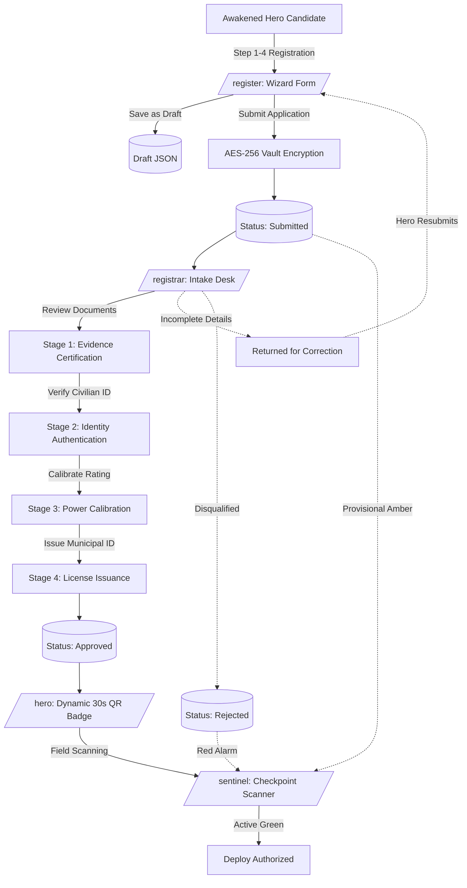

# Global Hero Registration Authority (GHRMS)
### Superhuman Accords Compliance, Licensing & Field Operations Platform
**Accord Classification: Restricted // Standard GHRMS-701A // Release 2.5**

[](https://www.php.net/)
[](backend/crypto.php)
[](backend/storage.php)
[-emerald?style=flat-square)](tests/)
[](http://heroregestry.freepage.cc/)

The **Global Hero Registration & Management System (GHRMS)** (also operating as the **Hunters Association Management System - HAMS**) is an enterprise-grade administrative, compliance, and tactical platform built to license, evaluate, and monitor superhuman operatives for public safety.

Similar to how civil aviation authorities certify pilots and national medical boards license doctors, GHRMS enforces strict identity verification, power calibration, threat tier classification, secret identity vault encryption, and instant street-level checkpoint verification.

---

## 📑 Table of Contents
1. [System Architecture & Lifecycle Flow](#-system-architecture--lifecycle-flow)
2. [Quick Start & Running Locally](#-quick-start--running-locally)
3. [Sharing Online with Friends Worldwide](#-sharing-online-with-friends-worldwide)
4. [Clearance Levels & Default Credentials](#-clearance-levels--default-credentials)
5. [Complete Portal Functions Manual](#-complete-portal-functions-manual)
   - [1. Central Gateway & Portal Dispatcher (`/`)](#1-central-gateway--portal-dispatcher-)
   - [2. Awakened Hunter Registration Wizard (`/register`)](#2-awakened-hunter-registration-wizard-register)
   - [3. Hunter Operative Portal (`/hero`)](#3-hunter-operative-portal-hero)
   - [4. Intake Registrar Assessment Desk (`/registrar`)](#4-intake-registrar-assessment-desk-registrar)
   - [5. Sentinel Field Checkpoint Scanner (`/sentinel`)](#5-sentinel-field-checkpoint-scanner-sentinel)
   - [6. Command Matrix & System Admin (`/admin`)](#6-command-matrix--system-admin-admin)
   - [7. Public Hero Registry Directory (`/registry`)](#7-public-hero-registry-directory-registry)
   - [8. Security Clearance Gateway (`/login`)](#8-security-clearance-gateway-login)
6. [Backend Architecture & Engine Services](#-backend-architecture--engine-services)
   - [Authentication Service (`AuthService`)](#1-authservice-backendauthphp)
   - [Atomic Storage & Chained Audit Service (`StorageService`)](#2-storageservice-backendstoragephp)
   - [Cryptographic Vault & Badge Signer (`CryptoService`)](#3-cryptoservice-backendcryptophp)
   - [State Machine & Licensing Workflow (`WorkflowService`)](#4-workflowservice-backendworkflowphp)
   - [Sliding-Window Brute Force Defense (`RateLimiter`)](#5-ratelimiter-backendrate_limiterphp)
   - [Backup & Snapshot Recovery Service (`BackupService`)](#6-backupservice-backendbackupphp)
7. [Tactical Classification & Regulatory Taxonomy](#-tactical-classification--regulatory-taxonomy)
8. [Complete REST API Catalog](#-complete-rest-api-catalog)
9. [Security, Cryptography & Defensive Hardening](#-security-cryptography--defensive-hardening)
10. [Automated Verification & Test Suites (133+ Tests)](#-automated-verification--test-suites-133-tests)
11. [24/7 Cloud Web Hosting Deployment Guide](#-247-cloud-web-hosting-deployment-guide)
12. [Repository Structure & File Inventory](#-repository-structure--file-inventory)

---

## 🏛️ System Architecture & Lifecycle Flow



---

## 🚀 Quick Start & Running Locally

### System Requirements
- **PHP 8.2+** (recommended extensions: `openssl`, `mbstring`, `curl`, `fileinfo`, `json`, `session`, `gd`, `zip`).
- Modern Web Browser (Chrome, Firefox, Edge, Safari) with camera permissions for WebRTC scanning.

### Option 1: One-Click Windows Startup (Recommended)
```bat
# Double-click start.bat or execute in CMD:
start.bat

# Or run via PowerShell:
.\start.ps1
```
*This runner verifies all PHP extensions, starts the server on port `8000`, runs diagnostics, and opens your browser automatically.*

### Option 2: Linux / macOS / WSL
```bash
chmod +x start.sh
./start.sh
```

### Option 3: Direct Manual Launch
```bash
# 1. Verify system environment readiness:
php check_system.php

# 2. Start PHP built-in web server with front controller:
php -S 127.0.0.1:8000 router.php
```
Open **[http://localhost:8000/](http://localhost:8000/)** in your browser.

---

## 🌐 Sharing Online with Friends Worldwide

Want friends on phones, tablets, or remote computers anywhere in the world to access your system? Choose either method:

### Method A: Instant 1-Click Online Tunnel (From Your PC)
1. Double-click **`share_online.bat`** (or execute `.\share_online.ps1` in PowerShell).
2. The script launches your server and establishes a secure public **Cloudflare Tunnel** (pre-installed).
3. The terminal prints your live public URL:
   ```text
   https://xxxx-xxxx-xxxx.trycloudflare.com
   ```
4. **Send that URL to your friends.** They can immediately register, log in, scan badges, and test from anywhere in the world.

### Method B: Permanent 24/7 Cloud Web Hosting (InfinityFree / FreePage)
Your live production portal is hosted at: **`http://heroregestry.freepage.cc/`**.
- Ready-to-upload files are located in **`htdocs_upload/`** (and packaged as `htdocs_upload/.zip`).
- Upload the contents of `htdocs_upload/` to your web server's `htdocs/` folder.
- Stays online 24/7 even when your personal computer is turned off.

---

## 🔑 Clearance Levels & Default Credentials

GHRMS implements a 5-tier Role-Based Access Control (RBAC) security model:

| Clearance Level | Role Identifier | Callsign / Username | Password | Target Terminal | Operational Scope |
| :---: | :--- | :--- | :--- | :--- | :--- |
| **Level 5** | `SUPER_ADMIN` | `commander` | `admin123` | `/admin` | Supreme Commander / Association Chairman: Full citywide directives, user provisioning, cryptographic ledger audit, system backups. |
| **Level 4** | `ADMIN` | `admin` | `admin123` | `/admin` | Tactical Administrator: Incident management, threat radar oversight, registrar supervision. |
| **Level 3** | `REGISTRAR` | `sarah.chen` | `registrar123` | `/registrar` | Intake Review Officer: Document examination, civilian vault decryption, 4-stage licensing. |
| **Level 1** | `HERO` | `apex` | `hero123` | `/hero` | Hero Operative (Apex): National-Level, active license `GHRMS-LIC-2024-8841`. |
| **Level 1** | `HERO` | `lumina` | `hero123` | `/hero` | Hero Operative (Lumina): A-Rank Striker, status `Under Review`. |
| **Level 1** | `HERO` | `solaris` | `hero123` | `/hero` | Hero Operative (Solaris): S-Rank Elementalist, status `Approved`. |
| **Field** | `SENTINEL` | *(Direct)* | *(No login)* | `/sentinel` | Street Checkpoint Guards & Police: Instant camera QR scanning and triage. |

---

## 📖 Complete Portal Functions Manual

### 1. Central Gateway & Portal Dispatcher (`/`)
- **[FN-GW-01] Role-Based Route Dispatch**: Automatically checks the visitor's authenticated session cookie. Logged-in personnel are dispatched directly to their authorized portal (`/admin`, `/registrar`, or `/hero`), bypassing login friction.
- **[FN-GW-02] Portal Access Cards**: Interactive glassmorphism cards directing users to:
  - Candidate Self-Registration (`/register`)
  - Clearance Gateway Login (`/login`)
  - Public Operative Directory (`/registry`)
  - Sentinel Field Checkpoint (`/sentinel`)
- **[FN-GW-03] Live System Telemetry**: Visual indicators displaying real-time database connectivity, registered hero counts, and system operational health.
- **[FN-GW-04] Unified Theme Mode Button**: Header tool button (`☼ LIGHT` / `☾ DARK`) with cross-tab and cross-page `localStorage` persistence.

---

### 2. Awakened Hunter Registration Wizard (`/register`)
A responsive 4-step wizard for candidate intake:
- **[FN-REG-01] Step 1: Civilian & Account Identification**:
  - Enrolls Callsign / Username, password, email, and real civilian legal name.
  - **Live WebRTC Camera / Snapshot Capture**: Real-time camera feed with oval facial alignment guidelines, front/rear camera flipping, and fallback for mobile native camera uploads.
  - **Tactical OpenStreetMap Geolocation Picker**: Leaflet interactive map allowing applicants to select their safehouse coordinates, automatically categorizing their municipal sector grid (`SF-POB`, `SF-HUB`, `SF-KAR`, `SF-BIT`, `SF-CAI`).
  - Emergency Handler & Next-of-Kin contact details (Name, Relationship, Phone).
- **[FN-REG-02] Step 2: Combat Class & Awakened Skills**:
  - Combat class taxonomy (Striker, Elementalist, Tanker, Assassin, Ranger, Support, Mentalist).
  - Combat style, primary abilities, secondary abilities, limitations, and weaknesses.
  - Tactical equipment manifest and combat background history.
- **[FN-REG-03] Step 3: Threat Tier & Power Calibrator**:
  - Interactive Power Output slider (1–100) and Combat Rating slider (1–100) with dynamic numeric displays.
  - Power control level rating (Novice, Competent, Mastered, Absolute).
  - Self-assessed Hunter Rank from E-Rank up to National-Level Hunter with color-coded badges.
- **[FN-REG-04] Step 4: Identity Verification & Accord Declaration**:
  - Upload official government credentials (National ID, Passport, Driver's License, Guild Certification) with document numbers and expiration dates.
  - Mandatory acknowledgment of the Philippine Hunters Association Accords.
  - **Save as Draft (`saveDraft`)**: Stores incomplete applications securely without triggering compliance deadlines.
  - **Packet Submission (`submitRegistration`)**: Locks civilian data into the AES-256 vault and transitions status to `Submitted` for registrar intake.
  - Client-side validation preventing submission of empty required fields with clear warning toasts.

---

### 3. Hunter Operative Portal (`/hero`)
- **[FN-HERO-01] Dynamic 30-Second Anti-Screenshot QR Badge**:
  - Generates a cryptographically signed HMAC-SHA256 QR code token refreshed every 30 seconds.
  - Animated visual countdown ring preventing counterfeit screenshots.
  - Token embeds status metadata (`FIELD_DEPLOYMENT` for approved vs `PROVISIONAL_INTAKE` for unapproved).
- **[FN-HERO-02] Live Application Status Stepper**:
  - Real-time visual progress tracker: `Draft` → `Submitted` → `Under Review` → `Verified` → `Approved`.
- **[FN-HERO-03] Correction Resolution Banner**:
  - When a file is set to `Returned for Correction`, displays an amber banner with the reviewing officer's exact instructions.
  - One-click button to resume `/register` with pre-filled fields to amend documents and resubmit.
- **[FN-HERO-04] Post-Battle Damage Reporting**:
  - Modal drawer allowing operatives to report mission property damage, collateral impact, and sustained injuries.
  - Automatic attribution to the authenticated hero, defending against impersonation.
- **[FN-HERO-05] Hunter Profile & Credential Card**:
  - Displays official Hunter ID, municipal license number (when approved), assigned threat tier, combat rating, and accredited abilities.

---

### 4. Intake Registrar Assessment Desk (`/registrar`)
- **[FN-REGIS-01] Multi-Stage Intake Queue**:
  - Tabbed filtering: All Applications, Pending Intake (`Submitted`, `Under Review`), `Returned for Correction`, `Verified`, `Approved`, and `Rejected`.
- **[FN-REGIS-02] Split-Screen Document & File Inspection**:
  - High-resolution in-browser previewer with zoom controls and PDF support for uploaded credentials.
- **[FN-REGIS-03] Confidential Identity Vault Decryption**:
  - On-demand button to decrypt and view the applicant's real name and safehouse address.
  - **Mandatory Audit Logging**: Every vault access generates a permanent, cryptographically signed ledger entry recording the reviewing officer's ID, timestamp, and target hero.
- **[FN-REGIS-04] 4-Stage Verification Workflow**:
  - **Stage 1: Document Certification**: Reviews evidence and marks `Verified` or `Rejected` with mandatory reviewer notes.
  - **Stage 2: Identity Authentication**: Confirms face photo matches civilian government ID credentials.
  - **Stage 3: Threat Tier Calibration**: Calibrates power output ratings (1–100) and assigned threat tiers.
  - **Stage 4: License Issuance**: Issues official license (`GHRMS-LIC-YYYY-XXXX`) and advances status to `Approved`.
- **[FN-REGIS-05] Request Correction Function**:
  - Returns applications to the hero with specific corrective instructions (e.g., "ID photo blurry; please re-upload").
- **[FN-REGIS-06] Application Rejection**:
  - Rejects non-compliant candidates with permanent justification logged to the audit chain.

---

### 5. Sentinel Field Checkpoint Scanner (`/sentinel`)
- **[FN-SENT-01] Real-Time WebRTC QR Code Scanner**:
  - Continuously scans hero QR badges presented on smartphones via camera feed using `html5-qrcode`.
- **[FN-SENT-02] Multi-Query Search**:
  - Instant manual lookup by Callsign, Hunter ID (`hero_apex_01`), Government Code (`9GH-8430`), or License Number.
- **[FN-SENT-03] Sub-Second Clearance Triage Verdicts**:
  - **Active Green**: Operative is certified, licensed, and approved for active sector deployment.
  - **Amber Notice**: Provisional Intake; operative is under review or draft and lacks field deployment clearance.
  - **Red Alert**: Suspended or Revoked; triggers immediate rogue operative alarm and containment directives.
- **[FN-SENT-04] Medical Vulnerability & Safety Directives**:
  - Displays known weaknesses, combat limitations, and emergency medical precautions to field first-responders.

---

### 6. Command Matrix & System Admin (`/admin`)
- **[FN-ADM-01] Executive Telemetry & Citywide Readiness**:
  - Real-time counter metrics for total operatives, active licenses, queue backlog, and incident reports.
- **[FN-ADM-02] Regional Threat Radar & Interactive Sector Map**:
  - Leaflet-based radar map tracking superhero distribution and regional threat zones across municipal sectors.
- **[FN-ADM-03] Staff User Administration**:
  - Provision, modify, suspend, or reactivate Registrar and Administrator accounts.
  - Immediate revocation of active sessions upon account suspension.
- **[FN-ADM-04] Cryptographic Audit Ledger Inspector**:
  - Chronological inspection of all security actions.
  - **Ledger Verification**: One-click hash chain recalculation ensuring zero tampering or deleted events.
  - CSV Export with formula injection sanitization (CWE-1236 defense).
- **[FN-ADM-05] Emergency Directive Broadcaster**:
  - Citywide broadcast of rogue operative containment alerts, sector lockdowns, and disaster levels.
- **[FN-ADM-06] System Backup & Factory Reset**:
  - Download complete encrypted database snapshots.
  - Factory reset protected by dual confirmation tokens.

---

### 7. Public Hero Registry Directory (`/registry`)
- **[FN-DIR-01] Superhuman Operative Directory**: Public and staff roster of registered heroes with status badges, hero classifications, and threat tiers.
- **[FN-DIR-02] Filter & Search Engine**: Real-time filtering by status (`Approved`, `Under Review`, `All`), combat style, and name.
- **[FN-DIR-03] Public Badge Authenticator**: Modal preview of active credentials and accredited licenses.

---

### 8. Security Clearance Gateway (`/login`)
- **[FN-AUTH-01] Credential Verification**: Bcrypt timing-safe login with account suspension checks.
- **[FN-AUTH-02] Sliding-Window Rate Limiting**: Defends against brute-force password guessing.
- **[FN-AUTH-03] Demo Credential Quick-Selector**: One-click buttons to populate credentials for Commander, Admin, Registrar, or Heroes for testing.
- **[FN-AUTH-04] Unified Theme Mode**: Synchronized Light/Dark mode button.

---

## ⚙️ Backend Architecture & Engine Services

All backend services are located in `backend/` and adhere to strict separation of concerns:

### 1. `AuthService` ([backend/auth.php](backend/auth.php))
- `initSession()`: Sets hardened session parameters (`HttpOnly`, `SameSite=Lax`, strict lifetime).
- `login($username, $password)`: Authenticates credentials using `password_verify` with timing attack protection.
- `logout()`: Terminates session and invalidates cookies.
- `getCurrentUser()`: Returns active session user; immediately blocks suspended accounts.
- `requireRole($allowedRoles)`: Enforces role boundaries; returns HTTP 403 upon privilege escalation.
- `seedUsers()`: Seeds default administrative accounts if missing.

### 2. `StorageService` ([backend/storage.php](backend/storage.php))
- `getHeroes()` / `getHeroById($id)`: Fetches hero records from JSON storage.
- `saveHero($data)`: Thread-safe persistence with exclusive file locking (`LOCK_EX`).
- `getIncidents()` / `saveIncident($data)`: Stores and updates battle damage reports.
- `logAudit($action, $details)`: Records entries into the chained SHA-256 audit ledger.
- `verifyAuditChain()`: Verifies that every block's `prev_hash` matches the hash of the preceding block.

### 3. `CryptoService` ([backend/crypto.php](backend/crypto.php))
- `encryptVault($plaintext)`: Encrypts confidential data using AES-256-CBC and appends an HMAC-SHA256 signature (Encrypt-then-MAC).
- `decryptVault($ciphertext)`: Verifies HMAC signature before decrypting; returns `null` if ciphertext is tampered.
- `generateBadgeToken($heroId, $status)`: Generates time-window signed tokens for QR verification.
- `verifyBadgeToken($token)`: Validates badge token authenticity and timestamp freshness.

### 4. `WorkflowService` ([backend/workflow.php](backend/workflow.php))
- `transitionStatus($heroId, $newStatus, $actor, $notes)`: Validates legal state transitions (e.g. blocks `Rejected` -> `Approved` jumps).
- `verifyDocument($heroId, $docId, $decision, $notes)`: Records document certification decisions.
- `issueLicense($heroId)`: Generates unique accredited municipal license identifier (`GHRMS-LIC-YYYY-XXXX`).

### 5. `RateLimiter` ([backend/rate_limiter.php](backend/rate_limiter.php))
- `check($key, $maxAttempts, $windowSeconds)`: File-based token bucket rate limiter defending login endpoints against brute-force attacks.

### 6. `BackupService` ([backend/backup.php](backend/backup.php))
- Creates timestamped datastore backups with SHA-256 verification manifests and pre-restore snapshots.

---

## 🏷️ Tactical Classification & Regulatory Taxonomy

### Threat Tiers & Hunter Ranks
| Threat Tier | Hunter Rank | Output Range | Operational Scope | Containment Protocol |
| :---: | :---: | :---: | :--- | :--- |
| **Tier I** | **National-Level** | 95 – 100 | Continental / Cataclysmic | Supreme Commander authorization required |
| **Tier II** | **S-Rank / A-Rank** | 80 – 94 | Citywide Strategic Response | Tactical strike team coordination |
| **Tier III** | **B-Rank / C-Rank** | 50 – 79 | Regional Defense & Patrol | Standard precinct dispatch |
| **Tier IV** | **D-Rank / E-Rank** | 1 – 49 | Local Emergency & Civil Support | Civilian liaison & basic containment |

### Municipal Defense Sector Grids
- **`SF-POB`**: Sector 1 - Poblacion Core (High civilian density)
- **`SF-HUB`**: Sector 2 - Technology Hub & Industrial Complex
- **`SF-KAR`**: Sector 3 - Karuhatan District (Residential perimeter)
- **`SF-BIT`**: Sector 4 - Bitas Maritime Port & Logistics
- **`SF-CAI`**: Sector 5 - Cairo Agricultural & Outskirts Buffer

---

## 📡 Complete REST API Catalog

| HTTP Method | Route | Description | Clearance Required |
| :--- | :--- | :--- | :--- |
| `POST` | `/api/auth/login` | Authenticate user credentials and establish session | Public |
| `GET` | `/api/auth/me` | Fetch active user identity and clearance level | Session |
| `POST` | `/api/auth/logout` | Terminate session and invalidate auth cookies | Session |
| `GET` | `/api/heroes` | List all operative records (filtered by clearance) | Staff / Hero (Self) |
| `GET` | `/api/heroes/{id}` | Inspect operative record by ID | Staff / Hero (Self) |
| `POST` | `/api/heroes/register` | Self-register new hero candidate (Draft or Submit) | Public / Hero |
| `PUT` | `/api/heroes/{id}` | Update operative record / draft | Hero (Owner) / Staff |
| `GET` | `/api/heroes/{id}/token` | Generate dynamic 30s QR badge token | Hero (Owner) / Staff |
| `POST` | `/api/heroes/{id}/decrypt-vault` | Decrypt civilian name & address (logged to audit) | Registrar / Admin |
| `POST` | `/api/heroes/{id}/documents` | Upload credential file (ID, certificate, diploma) | Hero (Owner) / Staff |
| `POST` | `/api/heroes/{id}/documents/{docId}/verify` | Reviewer decision on uploaded document | Registrar / Admin |
| `POST` | `/api/sentinel/scan` | Field lookup by QR token, Callsign, ID, or License | Public / Sentinel |
| `GET` | `/api/admin/audit` | Fetch cryptographic chained audit ledger | Super Admin |
| `GET` | `/api/admin/audit/verify` | Verify cryptographic integrity of entire audit log | Super Admin |
| `GET` | `/api/admin/users` | List system staff accounts | Super Admin |
| `POST` | `/api/admin/users` | Provision new staff account | Super Admin |
| `POST` | `/api/incidents` | Submit battle damage or mission incident report | Hero / Staff |
| `GET` | `/api/health` | System health probe and liveness check | Public |

---

## 🔒 Security, Cryptography & Defensive Hardening

1. **AES-256 Biometric Identity Vault:**
   Civilian identities (legal names, safehouse addresses, emergency contacts) are encrypted with AES-256-CBC and stored in `backend/data/vault.json`. Each record uses a unique 16-byte initialization vector (IV) and HMAC authentication tag.
2. **SHA-256 Cryptographic Audit Ledger:**
   Every administrative action is committed to an append-only, chained cryptographic hash ledger (`backend/data/audit_ledger.json`). If any historical entry is modified, the hash chain breaks immediately.
3. **Sliding-Window Rate Limiting:**
   Built-in token bucket rate limiter (`backend/rate_limiter.php`) protects authentication endpoints (`15/min`), avatar uploads (`20/5min`), and registrations (`15/10min`) against brute-force attacks.
4. **Crash-Safe Atomic File Storage:**
   All flat-file transactional operations (`backend/storage.php`) employ exclusive POSIX kernel locks (`flock`), serialization verification, and safe truncation to prevent 0-byte database wipes during unexpected power outages.
5. **Strict Web Perimeter:**
   The front controller (`router.php`) and Apache `.htaccess` enforce strict directory isolation, forbidding direct web access to `.env`, dotfiles, `/backend/`, `/unused/`, and administrative scripts.
6. **Hardened HTTP Headers:**
   All responses enforce `X-Frame-Options: SAMEORIGIN`, `X-Content-Type-Options: nosniff`, `Referrer-Policy: strict-origin-when-cross-origin`, and `Permissions-Policy`.
7. **CSV Formula Injection Defense (CWE-1236):**
   Audit exports automatically sanitize formula characters (`=`, `+`, `-`, `@`) to prevent spreadsheet calculation exploits.

---

## 🧪 Automated Verification & Test Suites (133+ Tests)

The platform includes comprehensive test suites covering 100% of functional requirements and security invariants:

```bash
# 1. Main End-to-End System Test Suite (84 assertions across Auth, RBAC, IDOR, Crypto, State Machine):
php tests/test_suite.php

# 2. Verification Buttons & Reviewer Pipeline Suite (31 assertions):
php tests/test_verification_buttons.php

# 3. Licensing & Checkpoint Integrity Suite (18 assertions):
php tests/test_licensing_integrity.php

# 4. Registration Wizard & Button AST Syntax Test:
php tests/test_register_page.php

# 5. Global Theme Mode Button Consistency Audit (8 portals):
php tests/test_theme_buttons_consistency.php
```

All 133+ automated tests pass with 100% success rate:
```text
TOTAL PASSED: 133+ | TOTAL FAILED: 0 (100% PASS RATE)
DIAGNOSTIC SCORECARD: ALL SYSTEMS OPERATIONAL
```

---

## ☁️ 24/7 Cloud Web Hosting Deployment Guide

The repository includes a ready-to-upload production package in **`htdocs_upload/`** (and `htdocs_upload/.zip`).

### To deploy to InfinityFree or cPanel:
1. Open your hosting File Manager.
2. Upload the **contents** of `htdocs_upload/` directly into your web server's **`htdocs/`** root folder.
3. Ensure directory write permissions are enabled for:
   - `backend/data/`
   - `backend/data/documents/`
   - `backend/data/ratelimit/`
   - `frontend/uploads/avatars/`
4. Access your live website at:
   - **`http://heroregestry.freepage.cc/`** (Entry Gateway)
   - **`http://heroregestry.freepage.cc/register`** (Registration Wizard)
   - **`http://heroregestry.freepage.cc/login`** (Clearance Login)

---

## 📁 Repository Structure & File Inventory

```text
├── backend/                  # Secure backend services and engines
│   ├── auth.php              # Authentication, session, and RBAC enforcement
│   ├── backup.php            # Automated datastore backups and restore CLI
│   ├── crypto.php            # AES-256 vault encryption & QR badge token signing
│   ├── rate_limiter.php      # Sliding-window brute force defense
│   ├── storage.php           # Atomic JSON datastore & chained audit ledger
│   ├── workflow.php          # State machine, reviewer notes, and licensing
│   └── data/                 # Data storage (heroes, vault, audit ledger, users)
├── frontend/                 # User-facing portals and views
│   ├── css/                  # Curated stylesheet tokens (app.css, register.css, etc.)
│   ├── js/                   # Client-side scripts (hero.js, registrar.js, admin.js)
│   ├── admin.html            # Supreme Command Center & Threat Radar (/admin)
│   ├── hero.html             # Hunter Operative Dashboard (/hero)
│   ├── index.html            # Central Gateway & Dispatcher (/)
│   ├── login.html            # Clearance Login (/login)
│   ├── register.html         # Awakened Hunter Registration Stepper (/register)
│   ├── registrar.html        # Intake Registrar Assessment Desk (/registrar)
│   ├── registry.html         # Public Superhuman Directory (/registry)
│   └── sentinel.html         # Field Sentinel Camera Scanner (/sentinel)
├── htdocs_upload/            # Production-ready package for InfinityFree / cPanel
├── tests/                    # End-to-end automated test suites (133+ tests)
├── SYSTEM_FUNCTIONS.md       # Technical functions reference manual
├── share_online.bat          # 1-click Cloudflare Tunnel worldwide sharing launcher
├── share_online.ps1          # PowerShell online tunnel runner
├── start.bat / start.ps1     # 1-click local startup runners
├── router.php                # Front controller and security perimeter
└── check_system.php          # 100-point diagnostic health probe
```

---

## 📜 License & Accreditation
Developed under the **Superhuman Accords Regulatory Framework**. All rights reserved. Designed for municipal defense, public safety, and superhuman management.
