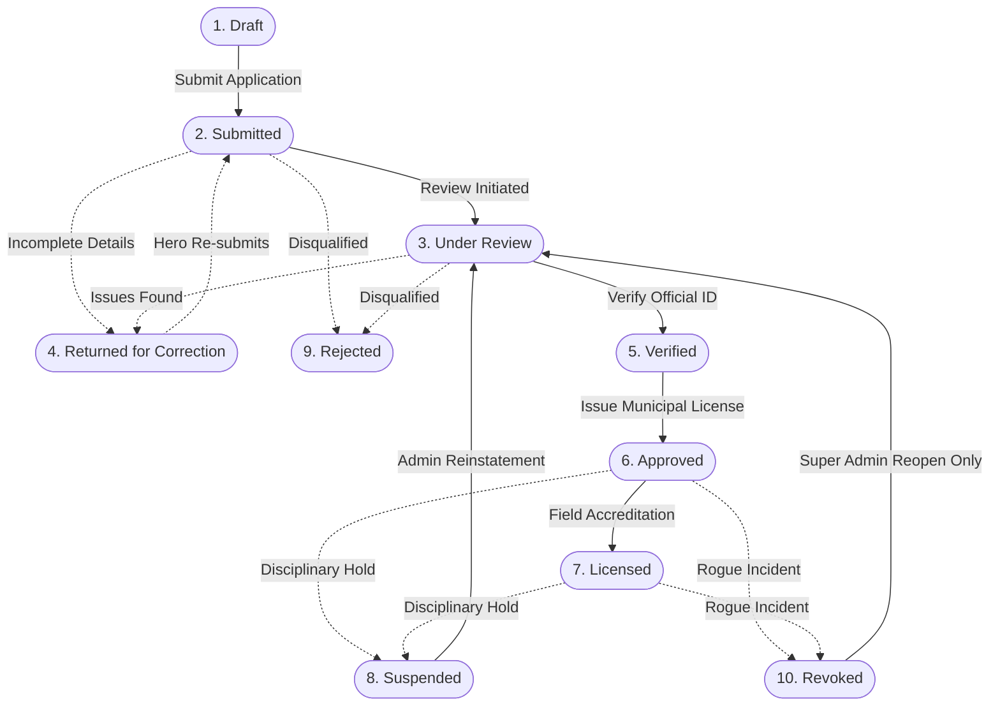

# Global Hero Registration Authority (GHRMS)
### Superhuman Accords Compliance, Hunter Licensing & Field Operations Platform
**Accord Classification: Restricted // Standard GHRMS-701A // Release 2.5 // Philippine Hunters Association (HAMS)**

[](https://www.php.net/)
[](backend/crypto.php)
[](backend/storage.php)
[-emerald?style=flat-square)](tests/)
[](http://heroregestry.freepage.cc/)

The **Global Hero Registration & Management System (GHRMS)** (also operating as the **Hunters Association Management System - HAMS**) is an enterprise-grade administrative, compliance, and tactical platform built to license, evaluate, and monitor superhuman operatives for public safety.

Operating under the **Philippine Hunters Association** in the **San Francisco, Agusan del Sur Jurisdiction**, GHRMS enforces strict identity verification, power calibration, threat tier classification, secret identity vault encryption, and instant street-level checkpoint verification.

---

## 📑 Table of Contents
1. [System Architecture & Lifecycle State Machine](#-system-architecture--lifecycle-state-machine)
2. [Quick Start & Running Locally](#-quick-start--running-locally)
3. [Sharing Online with Friends Worldwide](#-sharing-online-with-friends-worldwide)
4. [Security Clearance Levels & Default Credentials](#-security-clearance-levels--default-credentials)
5. [Complete Portal Functions Manual (All 8 Portals)](#-complete-portal-functions-manual-all-8-portals)
   - [1. Central Gateway & Route Dispatcher (`/`)](#1-central-gateway--route-dispatcher-)
   - [2. Awakened Hunter Registration Stepper (`/register`)](#2-awakened-hunter-registration-stepper-register)
   - [3. Hunter Operative Portal (`/hero`)](#3-hunter-operative-portal-hero)
   - [4. Intake Registrar Assessment Desk (`/registrar`)](#4-intake-registrar-assessment-desk-registrar)
   - [5. Sentinel Field Checkpoint Terminal (`/sentinel`)](#5-sentinel-field-checkpoint-terminal-sentinel)
   - [6. Supreme Command Center & System Admin (`/admin`)](#6-supreme-command-center--system-admin-admin)
   - [7. Superhuman Operative Directory (`/registry`)](#7-superhuman-operative-directory-registry)
   - [8. Security Clearance Gateway (`/login`)](#8-security-clearance-gateway-login)
6. [Backend Architecture & Engine Services](#-backend-architecture--engine-services)
   - [`AuthService` (Authentication & Session Management)](#1-authservice-backendauthphp)
   - [`JsonStorage` (Thread-Safe Atomic Persistence)](#2-jsonstorage-backendstoragephp)
   - [`CryptoService` (AES-256 Vault & Chained SHA-256 Ledger)](#3-cryptoservice-backendcryptophp)
   - [`RegistrationWorkflow` (10-State Lifecycle Machine)](#4-registrationworkflow-backendworkflowphp)
   - [`RateLimiter` (Sliding-Window Brute-Force Throttle)](#5-ratelimiter-backendrate_limiterphp)
   - [`backup.php` (Disaster Recovery & CLI Backup Utility)](#6-backupphp-backendbackupphp)
7. [Tactical Classification & Regulatory Taxonomy](#-tactical-classification--regulatory-taxonomy)
   - [Hunter Threat Tiers (Solo Leveling Taxonomy)](#hunter-threat-tiers-solo-leveling-taxonomy)
   - [Municipal Defense Sector Grids (Agusan del Sur)](#municipal-defense-sector-grids-agusan-del-sur)
   - [Hunter Combat Classes & Power Archetypes](#hunter-combat-classes--power-archetypes)
8. [Complete REST API Catalog (49 Endpoints & Actions)](#-complete-rest-api-catalog-49-endpoints--actions)
9. [Security, Cryptography & Defensive Hardening](#-security-cryptography--defensive-hardening)
10. [Automated Verification & Test Suites (133+ Tests)](#-automated-verification--test-suites-133-tests)
11. [24/7 Cloud Web Hosting Deployment Guide](#-247-cloud-web-hosting-deployment-guide)
12. [Repository Structure & File Inventory](#-repository-structure--file-inventory)

---

## 🏛️ System Architecture & Lifecycle State Machine

GHRMS manages hero operatives through a deterministic **10-State Lifecycle Engine** ([backend/workflow.php](backend/workflow.php)):



### State Machine Transition Invariants:
1. **Illegal Jump Prevention**: Rejected or Revoked records **CANNOT** transition directly to `Approved` or `Licensed` (HTTP 422). They must first be reopened to `Under Review` through formal administrative review.
2. **Super Admin Reopening Gate**: Only `SUPER_ADMIN` (Clearance Level 5) has the authority to reopen a `Revoked` record.
3. **Suspension Reinstatement**: Only `SUPER_ADMIN` and `ADMIN` can reinstate `Suspended` operatives.
4. **Hero Self-Action Boundaries**: Operative accounts (`HERO`) are strictly restricted to advancing `Draft` &rarr; `Submitted`, and `Returned for Correction` &rarr; `Submitted`.
5. **Evidence Review Gate**: An operative's identity **cannot** be verified (`VERIFY_IDENTITY`) unless a valid, unexpired `Official ID` has been certified by an authorized registrar.

---

## 🚀 Quick Start & Running Locally

### System Requirements
- **PHP 8.2+** (recommended extensions: `openssl`, `mbstring`, `curl`, `fileinfo`, `json`, `session`, `gd`, `zip`).
- Modern Web Browser (Chrome, Edge, Firefox, Safari) with camera permissions for WebRTC scanning.

### Option 1: One-Click Windows Startup (Recommended)
```bat
# Double-click start.bat or run in CMD:
start.bat

# Or run in PowerShell:
.\start.ps1
```
*This script checks required PHP extensions, verifies directory write permissions, starts the PHP server on port `8000`, and automatically launches your browser.*

### Option 2: Linux / macOS / WSL
```bash
chmod +x start.sh
./start.sh
```

### Option 3: Manual Startup
```bash
# 1. Run 100-point diagnostic health probe:
php check_system.php

# 2. Start PHP built-in web server with front controller:
php -S 127.0.0.1:8000 router.php
```
Visit **[http://localhost:8000/](http://localhost:8000/)** in your browser.

---

## 🌐 Sharing Online with Friends Worldwide

Want friends on phones, tablets, or laptops anywhere in the world to access and test the system? Choose either method:

### Method A: Instant 1-Click Online Tunnel (From Your PC)
1. Double-click **`share_online.bat`** (or execute `.\share_online.ps1` in PowerShell).
2. The script launches your local server and opens a secure public **Cloudflare Tunnel** (pre-installed).
3. The terminal displays your live public HTTPS link:
   ```text
   https://xxxx-xxxx-xxxx.trycloudflare.com
   ```
4. **Send that link to your friends.** They can immediately register, log in, scan badges, and test from anywhere in the world with zero setup!

### Method B: Permanent 24/7 Cloud Web Hosting (InfinityFree / FreePage)
The live production portal is pre-configured at: **`http://heroregestry.freepage.cc/`**.
- Ready-to-upload files are organized in the **`htdocs_upload/`** directory (and archived as `htdocs_upload/.zip`).
- Upload the contents of `htdocs_upload/` directly into your hosting web server's **`htdocs/`** root folder.
- The system stays online 24/7 without needing your computer to be turned on.

---

## 🔑 Security Clearance Levels & Default Credentials

GHRMS implements a 5-tier Role-Based Access Control (RBAC) hierarchy enforced at both the router and API layers:

| Clearance Level | Role Identifier | Username / Callsign | Password | Default Landing | Operational Authority |
| :---: | :--- | :--- | :--- | :--- | :--- |
| **Level 5** | `SUPER_ADMIN` | `commander` | `admin123` | `/admin` | Supreme Commander / Association Chairman: Citywide emergency directives, staff user provisioning, chained audit verification, factory resets. |
| **Level 4** | `ADMIN` | `admin` | `admin123` | `/admin` | Tactical Administrator: Incident dispatch, threat radar oversight, registrar supervision. |
| **Level 3** | `REGISTRAR` | `sarah.chen` | `registrar123` | `/registrar` | Intake Review Officer: Application examination, confidential identity vault decryption, 4-stage licensing. |
| **Level 1** | `HERO` | `apex` | `hero123` | `/hero` | Hero Operative (Apex): National-Level, accredited license `GHRMS-LIC-2024-8841`. |
| **Level 1** | `HERO` | `lumina` | `hero123` | `/hero` | Hero Operative (Lumina): A-Rank Striker, status `Under Review`. |
| **Level 1** | `HERO` | `solaris` | `hero123` | `/hero` | Hero Operative (Solaris): S-Rank Elementalist, status `Approved`. |
| **Field** | `SENTINEL` | *(Direct)* | *(No login)* | `/sentinel` | Street Checkpoint Guards & Police: Instant camera QR scanning and triage. |

---

## 📖 Complete Portal Functions Manual (All 8 Portals)

### 1. Central Gateway & Route Dispatcher (`/`)
- **[FN-GW-01] Role-Based Route Dispatch**: Inspects active session credentials and automatically routes visitors:
  - `SUPER_ADMIN` / `ADMIN` &rarr; Dispatched to `/admin`
  - `REGISTRAR` / `ASSESSOR` &rarr; Dispatched to `/registrar`
  - `HERO` &rarr; Dispatched to `/hero`
  - Unauthenticated visitors &rarr; Dispatched to `/login`
- **[FN-GW-02] Direct Terminal Access**: Public entry points to Candidate Self-Registration (`/register`), Clearance Login (`/login`), and Field Sentinel Checkpoint (`/sentinel`).
- **[FN-GW-03] Live System Telemetry**: Displays real-time database connectivity, registered hero counts, and system operational health.
- **[FN-GW-04] Unified Theme Mode Button**: Header tool button (`☼ LIGHT` / `☾ DARK`) with cross-page `localStorage` persistence.

---

### 2. Awakened Hunter Registration Stepper (`/register`)
A guided 4-step wizard designed for hero candidate onboarding:
- **[FN-REG-01] Step 1: Account Information & Civilian Identity**:
  - Enrolls Callsign / Username, password, email address, and real civilian legal name.
  - **Live WebRTC Camera / Snapshot Capture**: Captures facial portraits directly through the browser with oval HUD guidelines, front/rear camera flipping, and fallback for mobile native camera uploads.
  - **Tactical OpenStreetMap Geolocation Picker**: Leaflet interactive map allowing applicants to select their safehouse coordinates, automatically categorizing their municipal sector grid (`SF-POB`, `SF-HUB`, `SF-KAR`, `SF-BIT`, `SF-CAI`).
  - Emergency Handler & Next-of-Kin contact details (Name, Relationship, Phone).
- **[FN-REG-02] Step 2: Combat Class & Tactical Capabilities**:
  - Combat class taxonomy (Fighter, Mage, Tank, Assassin, Ranger, Healer).
  - Combat style, primary abilities, secondary abilities, limitations, and weaknesses.
  - Tactical equipment manifest and dungeon raid / combat experience background.
- **[FN-REG-03] Step 3: Power & Hero Tier Assessment**:
  - Interactive Power Output slider (1–100) and Combat Effectiveness slider (1–100).
  - Power control level rating (Novice, Competent, Mastered, Absolute).
  - Evaluated Hero Tier / Rank slider from E-Rank (Tier 6) up to National-Level (Tier 0).
  - Standing selection: Official Licensed Hero vs Guild Apprentice / Sidekick.
- **[FN-REG-04] Step 4: Official Hunter Verification & Supporting Credentials**:
  - Upload official government credentials (PhilSys National ID, Passport, Driver's License, Guild Clearance) with serial numbers and expiration dates.
  - Mandatory acknowledgment of the Philippine Hunters Association Accords.
  - **Save as Draft (`saveDraft`)**: Stores incomplete applications securely without triggering compliance deadlines.
  - **Packet Submission (`submitRegistration`)**: Locks civilian data into the AES-256 vault and transitions status to `Submitted` for registrar intake.
  - Client-side validation preventing submission of empty required fields with clear warning toasts.

---

### 3. Hunter Operative Portal (`/hero`)
- **[FN-HERO-01] Dynamic 30-Second Anti-Screenshot QR Badge**:
  - Generates a cryptographically signed HMAC-SHA256 QR code token refreshed every 30 seconds.
  - Animated visual countdown ring preventing counterfeit screenshots.
  - Token embeds status metadata (`FIELD_DEPLOYMENT` for approved vs `PROVISIONAL_INTAKE` for unapproved).
- **[FN-HERO-02] Live Application Status Stepper**:
  - Real-time visual progress tracker: `Draft` → `Submitted` → `Under Review` → `Verified` → `Approved`.
- **[FN-HERO-03] Correction Resolution Banner**:
  - When a file is set to `Returned for Correction`, displays an amber banner with the reviewing officer's exact instructions.
  - One-click button to resume `/register` with pre-filled fields to amend documents and resubmit.
- **[FN-HERO-04] Post-Battle Damage Reporting**:
  - Modal drawer allowing operatives to report mission property damage, collateral impact, and sustained injuries.
  - Automatic attribution to the authenticated hero, defending against impersonation.
- **[FN-HERO-05] Hunter Profile & Credential Card**:
  - Displays official Hunter ID, municipal license number (when approved), assigned threat tier, combat rating, and accredited abilities.
  - Modal view with PNG download for official physical ID printing.
- **[FN-HERO-06] Profile Modification Request Workflow**:
  - Operatives can submit proposed profile updates. These are saved to `backend/data/pending_updates.json` and require registrar approval before going live.

---

### 4. Intake Registrar Assessment Desk (`/registrar`)
- **[FN-REGIS-01] Multi-Mode Workspace**:
  - Mode 1: Intake Queue (`[1] INTAKE QUEUE`) - Filterable tabs: `Submitted`, `Under Review`, `Returned for Correction`.
  - Mode 2: Hero Roster (`[2] HERO ROSTER`) - Certified, licensed operatives.
  - Mode 3: Revoked Licenses (`[3] REVOKED LICENSES`) - Suspended and revoked operatives.
- **[FN-REGIS-02] Split-Screen Document & File Inspection**:
  - High-resolution in-browser previewer with zoom controls and PDF support for uploaded credentials.
- **[FN-REGIS-03] Confidential Identity Vault Decryption**:
  - On-demand button to decrypt and view the applicant's real name and safehouse address.
  - **Mandatory Audit Logging**: Every vault access generates a permanent, cryptographically signed ledger entry recording the reviewing officer's ID, timestamp, and target hero.
- **[FN-REGIS-04] 4-Stage Verification Workflow**:
  - **Stage 1: Document Certification**: Reviews evidence and marks `Verified` or `Rejected` with mandatory reviewer notes.
  - **Stage 2: Identity Authentication**: Confirms face photo matches civilian government ID credentials.
  - **Stage 3: Threat Tier Calibration**: Calibrates power output ratings (1–100) and assigned threat tiers.
  - **Stage 4: License Issuance**: Issues official license (`GHRMS-LIC-YYYY-XXXX`) and advances status to `Approved`.
- **[FN-REGIS-05] Request Correction Function**:
  - Returns applications to the hero with specific corrective instructions (e.g., "ID photo blurry; please re-upload").
- **[FN-REGIS-06] Application Rejection & License Revocation**:
  - Rejects non-compliant candidates or revokes compromised licenses with permanent justification logged to the audit chain.
- **[FN-REGIS-07] Sidekick Management & Promotion**:
  - Enroll sidekicks under accredited mentors and graduate veteran sidekicks to full Hero standing.
- **[FN-REGIS-08] Operative Passkey Reset**:
  - Generates secure random passkeys for hero operatives who have lost their credentials.

---

### 5. Sentinel Field Checkpoint Terminal (`/sentinel`)
- **[FN-SENT-01] Real-Time WebRTC QR Code Scanner**:
  - Continuously scans hero QR badges presented on smartphones via camera feed using `jsqr.min.js`.
  - Animated optical reticle with targeting laser line and audio confirmation cues.
- **[FN-SENT-02] Multi-Query Search**:
  - Instant manual lookup by Callsign, Hunter ID (`hero_apex_01`), Government Code (`9GH-8430`), or License Number.
- **[FN-SENT-03] Sub-Second Clearance Triage Verdicts**:
  - **Active Green**: Operative is certified, licensed, and approved for active sector deployment.
  - **Amber Notice**: Provisional Intake; operative is under review or draft and lacks field deployment clearance.
  - **Red Alert**: Suspended or Revoked; triggers immediate rogue operative alarm and containment directives.
- **[FN-SENT-04] Medical Vulnerability & Safety Directives**:
  - Displays known weaknesses, combat limitations, and emergency medical precautions to field first-responders.
- **[FN-SENT-05] Preset Test Target Chips**:
  - 1-click test buttons to simulate instant scans for APEX (Approved), LUMINA (Under Review), SOLARIS (Rogue), AERO SCOUT (Sidekick), and UNKNOWN Vigilante.

---

### 6. Supreme Command Center & System Admin (`/admin`)
- **[FN-ADM-01] Executive Telemetry & Citywide Readiness**:
  - Real-time counter metrics for total operatives, active licenses, queue backlog, and incident reports.
- **[FN-ADM-02] Regional Threat Radar & Interactive Sector Map**:
  - Leaflet-based radar map tracking superhero distribution and regional threat zones across municipal sectors.
  - Street and satellite map layer toggles.
- **[FN-ADM-03] Staff User Administration**:
  - Provision, modify, suspend, or reactivate Registrar and Administrator accounts.
  - Immediate revocation of active sessions upon account suspension.
- **[FN-ADM-04] Cryptographic Audit Ledger Inspector**:
  - Chronological inspection of all security actions.
  - **Ledger Verification**: One-click hash chain recalculation ensuring zero tampering or deleted events.
  - CSV Export with formula injection sanitization (CWE-1236 defense).
- **[FN-ADM-05] Emergency Directive Broadcaster**:
  - Citywide broadcast of rogue operative containment alerts, sector lockdowns, and disaster levels (`NORMAL - GREEN`, `ELEVATED - YELLOW`, `HIGH - ORANGE`, `CRITICAL - RED`).
- **[FN-ADM-06] System Backup & Factory Reset**:
  - Download complete encrypted database snapshots.
  - Factory reset protected by dual confirmation tokens.

---

### 7. Superhuman Operative Directory (`/registry`)
- **[FN-DIR-01] Staff-Restricted Operative Directory**: Public hero roster restricted to staff (`REGISTRAR`, `ASSESSOR`, `ADMIN`, `SUPER_ADMIN`) to protect superhuman identities. Normal heroes attempting access are redirected to `/hero?denied=registry`.
- **[FN-DIR-02] Filter & Search Engine**: Real-time filtering by status (`Approved`, `Under Review`, `All`), combat style, and name.
- **[FN-DIR-03] Public Badge Authenticator**: Modal preview of active credentials and accredited licenses.

---

### 8. Security Clearance Gateway (`/login`)
- **[FN-AUTH-01] Credential Verification**: Bcrypt timing-safe login with account suspension checks.
- **[FN-AUTH-02] Sliding-Window Rate Limiting**: Defends against brute-force password guessing (`15 attempts / minute`).
- **[FN-AUTH-03] Demo Credential Quick-Selector**: One-click buttons to populate credentials for Commander, Admin, Registrar, or Heroes for testing.
- **[FN-AUTH-04] Unified Theme Mode**: Synchronized Light/Dark mode button.

---

## ⚙️ Backend Architecture & Engine Services

### 1. `AuthService` ([backend/auth.php](backend/auth.php))
- `initSession()`: Configures hardened cookie flags (`HttpOnly`, `SameSite=Lax`, strict lifetime).
- `seedUsers()`: Guarantees baseline administrative accounts exist on fresh installations.
- `syncHeroUsers()`: Automatically maps registered hero records into `users.json` so every operative can log in.
- `login(string $username, string $password)`: Authenticates credentials using `password_verify` with bcrypt timing-safe comparison, session fixation protection, and suspension checks.
- `validatePasswordPolicy(string $password)`: Enforces passkey lengths between 6 and 128 characters.
- `destroySessionCookies()`: Invalidates session identifiers and clears cookies.
- `logout()`: Terminates active session and records an audit log event.
- `getCurrentUser()`: Returns authenticated session identity; enforces immediate revocation if account is suspended.
- `requireAuth()`: Blocks unauthenticated API requests with HTTP 401.
- `requireRole(array|string $roles)`: Enforces role boundaries; emits HTTP 403 upon privilege escalation.

### 2. `JsonStorage` ([backend/storage.php](backend/storage.php))
- `read(string $filePath, $default = [])`: Reads JSON datastores with shared POSIX locks (`LOCK_SH`).
- `write(string $filePath, $data)`: Writes JSON files with exclusive locks (`LOCK_EX`) and safe truncation.
- `writeSafe(string $filePath, $data)`: Crash-safe atomic write using temporary file swap (`tmp_ghrms_*`).
- `transaction(string $filePath, callable $modifier, $default = [])`: Executes state modifications inside exclusive locks.

### 3. `CryptoService` ([backend/crypto.php](backend/crypto.php))
- `encryptVault(array $bioData)`: Encrypts confidential fields using AES-256-CBC and attaches HMAC-SHA256 signature (Encrypt-then-MAC).
- `updateVault(string $vaultId, array $bioData)`: Re-encrypts existing vault records.
- `decryptVault(string $vaultId)`: Verifies HMAC signature before decrypting; returns `null` if payload has been tampered with.
- `migrateVaultHmac()`: Migrates legacy unauthenticated vault records to Encrypt-then-MAC.
- `generateBadgeToken(string $heroId, string $badgeSecret, int $timeStep = 30)`: Generates time-window signed tokens for QR verification.
- `verifyBadgeToken(string $heroId, string $badgeSecret, string $inputToken, int $timeStep = 30)`: Validates badge token authenticity with clock drift tolerance (±30s).
- `appendAudit(string $actor, string $role, string $action, string $targetId, array $details)`: Records entries into the chained SHA-256 audit ledger.
- `verifyAuditChain()`: Validates that each block's `prev_hash` matches the preceding block's hash.

### 4. `RegistrationWorkflow` ([backend/workflow.php](backend/workflow.php))
- `canTransition(string $currentStatus, string $newStatus, string $actorRole)`: Enforces valid state transitions across the 10-state lifecycle.
- `assertValidTransition(string $currentStatus, string $newStatus, string $actorRole)`: Terminates illegal transition attempts with HTTP 422 Unprocessable Entity.

### 5. `RateLimiter` ([backend/rate_limiter.php](backend/rate_limiter.php))
- `check(string $action, int $maxAttempts = 60, int $windowSeconds = 60)`: Sliding-window throttle preventing brute-force attacks.
- `reset(string $action, ?string $ip = null)`: Clears throttle counters upon successful authentication.
- `purgeStaleRateLimitFiles()`: Cleans expired rate limit cache files.

### 6. `backup.php` ([backend/backup.php](backend/backup.php))
- CLI utility for datastore disaster recovery:
  - `php backend/backup.php create`: Creates timestamped zip archive with SHA-256 manifest.
  - `php backend/backup.php list`: Lists available backup archives.
  - `php backend/backup.php verify <file>`: Validates archive checksums.
  - `php backend/backup.php restore <file> --force`: Restores data files with pre-restore safety snapshots.

---

## 🏷️ Tactical Classification & Regulatory Taxonomy

### Hunter Threat Tiers (Solo Leveling Taxonomy)
| Tier Code | Hunter Rank Name | Output Range | Operational Scope | Containment Directives |
| :---: | :--- | :---: | :--- | :--- |
| **Tier 0** | **National-Level Hunter** | 95 – 100 | Calamity Gate Subjugator | Supreme Commander authorization required |
| **Tier 1** | **S-Rank Hunter** | 85 – 94 | National Strategic Deterrent | Red Gate & Calamity raid commander |
| **Tier 2** | **A-Rank Hunter** | 75 – 84 | High-Tier Strike Team Leader | High-difficulty Gate subjugator |
| **Tier 3** | **B-Rank Hunter** | 60 – 74 | Elite Raid Party Combatant | Mid-to-high Gate specialist |
| **Tier 4** | **C-Rank Hunter** | 45 – 59 | Standard Dungeon Raid Combatant | Municipal security defense |
| **Tier 5** | **D-Rank Hunter** | 25 – 44 | Low-Level Dungeon Clearer | Basic resource harvesting |
| **Tier 6** | **E-Rank Hunter** | 1 – 24 | Support & Perimeter Duties | Lowest Awakened tier, civil support |

### Municipal Defense Sector Grids (Agusan del Sur)
- **Sector 1**: Poblacion Central Commercial Grid (`SF-POB`)
- **Sector 2**: Hubang Highway & Logistics Corridor (`SF-HUB`)
- **Sector 3**: Karaos & Borbon Uplands District (`SF-KAR`)
- **Sector 4**: Bitan-agan & Lapinigan River Basin (`SF-BIT`)
- **Sector 5**: Caimpugan Peatland Sanctuary & Marsh Shield (`SF-CAI`)

### Hunter Combat Classes & Power Archetypes
- **Fighter**: Frontline Physical Striker / Martial Combatant
- **Mage**: Ranged Elemental & Arcane Spellcaster / Barrier Weaver
- **Tank**: Frontline Vanguard / High-Durability Bastion & Aggro Control
- **Assassin**: High-Speed Covert Infiltration / Critical Lethal Striker
- **Ranger**: Ranged Precision Sniper / Bow & Projectile Specialist
- **Healer**: Restoration, Mana Replenishment & Purification Support

---

## 📡 Complete REST API Catalog (49 Endpoints & Actions)

| # | HTTP Method | Route / Endpoint | Description | Clearance Required |
| :-: | :--- | :--- | :--- | :--- |
| 1 | `GET` | `/api/health` | Health probe & liveness check (file stores & OpenSSL) | Public |
| 2 | `POST` | `/api/auth/login` | Authenticate callsign and passkey; start session | Public (Rate Limited) |
| 3 | `POST` | `/api/auth/logout` | Terminate session and invalidate auth cookies | Session |
| 4 | `GET` | `/api/auth/me` | Fetch active user identity and clearance level | Session |
| 5 | `GET` | `/api/notifications` | Universal tactical notifications & rogue alerts | Session |
| 6 | `GET` | `/api/heroes` | List all operative records (filtered by role) | Staff (`REGISTRAR`, `ADMIN`) |
| 7 | `GET` | `/api/heroes/{id}` | Inspect operative profile (IDOR protected) | Staff / Hero (Self) |
| 8 | `GET` | `/api/heroes/{id}/review` | Comprehensive review packet with document metadata | Registrar / Admin |
| 9 | `PUT` | `/api/heroes/{id}` | Edit hero record information | Registrar / Admin |
| 10 | `POST` | `/api/heroes/{id}/ftf-interview` | Submit face-to-face interview assessment data | Registrar / Admin |
| 11 | `DELETE` | `/api/heroes/{id}` | Permanently delete operative record | Super Admin (Level 5) |
| 12 | `POST` | `/api/heroes/{id}/enroll-sidekick` | Enroll applicant as sidekick under a mentor | Registrar / Admin |
| 13 | `POST` | `/api/heroes/{id}/promote-to-hero` | Graduate sidekick to full licensed hero | Registrar / Admin |
| 14 | `POST` | `/api/heroes/register` | Self-register new hero candidate (Draft or Submit) | Public / Hero |
| 15 | `POST` | `/api/heroes/{id}/documents` | Upload credential file (ID, Certificate, etc.) | Hero (Owner) / Staff |
| 16 | `GET` | `/api/heroes/{id}/documents/{docId}` | Secure credential file preview / download | Hero (Owner) / Staff |
| 17 | `DELETE` | `/api/heroes/{id}/documents/{docId}` | Delete document (blocked if already verified) | Hero (Owner) / Staff |
| 18 | `POST` | `/api/heroes/{id}/documents/{docId}/verify` | Reviewer decision (`Verified` / `Rejected` + notes) | Registrar / Admin |
| 19 | `POST` | `/api/upload-avatar` | Intake face photo upload | Public / Hero |
| 20 | `POST` | `/api/heroes/{id}/avatar` | Update operative face photo | Hero (Owner) / Staff |
| 21 | `GET` | `/api/heroes/{id}/badge-token` | Generate dynamic 30s HMAC-SHA256 badge token | Hero (Owner) / Staff |
| 22 | `POST` | `/api/verify-badge` | Verify dynamic badge token authenticity | Sentinel / Staff |
| 23 | `POST` | `/api/heroes/{id}/decrypt-vault` | Decrypt civilian name & address (logged to audit) | Registrar / Admin |
| 24 | `POST` | `/api/heroes/{id}/assess [APPROVE_LICENSE]` | Issue accredited license and advance to `Approved` | Registrar / Admin |
| 25 | `POST` | `/api/heroes/{id}/assess [REQUEST_CORRECTIONS]` | Return application with feedback notes | Registrar / Admin |
| 26 | `POST` | `/api/heroes/{id}/assess [RESUBMIT]` | Resubmit application after correcting issues | Hero (Owner) / Staff |
| 27 | `POST` | `/api/heroes/{id}/assess [MOVE_TO_REVIEW]` | Advance application status to `Under Review` | Registrar / Admin |
| 28 | `POST` | `/api/heroes/{id}/assess [VERIFY_IDENTITY]` | Verify civilian identity against official ID | Registrar / Admin |
| 29 | `POST` | `/api/heroes/{id}/assess [REJECT_REGISTRATION]` | Reject application with justification | Registrar / Admin |
| 30 | `POST` | `/api/heroes/{id}/assess [REVOKE_LICENSE]` | Revoke hero license for accord breaches | Registrar / Admin |
| 31 | `POST` | `/api/heroes/{id}/assess [SUSPEND_OPERATIVE]` | Temporarily suspend operative deployment | Registrar / Admin |
| 32 | `POST` | `/api/heroes/{id}/assess [REINSTATE]` | Reinstate suspended or revoked operative | Admin / Super Admin |
| 33 | `POST` | `/api/heroes/{id}/assess [REQUEST_POWER_AUDIT]` | Flag hero profile for power recalibration | Registrar / Admin |
| 34 | `POST` | `/api/heroes/{id}/assess [SET_THREAT_TIER]` | Calibrate threat tier / power output rating | Registrar / Admin |
| 35 | `POST` | `/api/heroes/{id}/assess [SET_ASSESSMENT]` | Update reviewer assessment scores & notes | Registrar / Admin |
| 36 | `POST` | `/api/heroes/{id}/assess [MAP_SIDEKICKS]` | Link sidekicks to mentor operative | Registrar / Admin |
| 37 | `POST` | `/api/damage-report` | Submit post-battle damage report | Hero / Staff |
| 38 | `POST` | `/api/heroes/{id}/request-update` | Hero submits proposed profile changes | Hero (Owner) |
| 39 | `GET` | `/api/pending-updates` | List all pending hero profile edit requests | Registrar / Admin |
| 40 | `GET` | `/api/heroes/{id}/pending-update` | Hero inspects status of own pending edit | Hero (Owner) |
| 41 | `POST` | `/api/pending-updates/{id}/approve` | Approve and commit hero profile update | Registrar / Admin |
| 42 | `POST` | `/api/pending-updates/{id}/reject` | Reject hero profile update with reason | Registrar / Admin |
| 43 | `GET` | `/api/damage-reports` | List all battle damage incident reports | Registrar / Admin |
| 44 | `POST` | `/api/damage-reports/{id}/match` | Match incident report to responsible hero | Registrar / Admin |
| 45 | `GET` | `/api/admin/metrics` | Executive readiness metrics & queue telemetry | Staff (`ADMIN`, `L5`) |
| 46 | `GET` | `/api/admin/map-data` | Tactical radar operative & incident coordinates | Staff (`ADMIN`, `L5`) |
| 47 | `POST` | `/api/admin/emergency-action` | Broadcast rogue containment alerts / lockouts | Admin / Super Admin |
| 48 | `GET` | `/api/sentinel/scan` | Checkpoint scan by QR token, Callsign, ID, License | Sentinel / Staff |
| 49 | `GET` | `/api/tactical-weather` | OpenWeatherMap meteorological radar telemetry | Staff (`ADMIN`, `L5`) |

---

## 🔒 Security, Cryptography & Defensive Hardening

1. **AES-256-CBC + HMAC-SHA256 Biometric Identity Vault:**
   Civilian identities (legal names, safehouse addresses, emergency contacts) are encrypted using AES-256-CBC with an isolated 16-byte initialization vector (IV) and HMAC-SHA256 authentication tag (Encrypt-then-MAC). Tampered ciphertexts return `null` and trigger an immediate audit security alarm.
2. **Cryptographic Chained SHA-256 Audit Ledger:**
   Every administrative action is appended to a cryptographic hash chain (`backend/data/audit_ledger.json`). Each block embeds the SHA-256 hash of the preceding entry:
   $$\text{Hash} = \text{SHA256}(\text{prev\_hash} \parallel \text{timestamp} \parallel \text{actor} \parallel \text{role} \parallel \text{action} \parallel \text{target\_id} \parallel \text{details})$$
   Modifying or deleting any historical record breaks the chain immediately.
3. **Sliding-Window Rate Limiting:**
   File-backed token bucket throttle protects authentication endpoints (`15 attempts / min`), avatar uploads (`20 / 5min`), and global API access (`300 / min`).
4. **Crash-Safe Atomic Flat-File Persistence:**
   All datastore mutations use exclusive POSIX locks (`flock(LOCK_EX)`), truncation safety, and temporary file swapping (`tmp_ghrms_*`) to prevent 0-byte corruptions during unexpected power cuts.
5. **Strict Web Perimeter & Path Traversal Defense:**
   `router.php` strictly forbids direct access to dotfiles (`.env`, `.git`), internal engine directories (`/backend/`, `/tests/`, `/unused/`), and configuration scripts. Realpath confinement blocks directory traversal attacks.
6. **Hardened HTTP Response Headers:**
   Enforces `X-Frame-Options: SAMEORIGIN`, `X-Content-Type-Options: nosniff`, `Referrer-Policy: strict-origin-when-cross-origin`, `Permissions-Policy: camera=(self)`, and strict `Content-Security-Policy`.
7. **CSV Formula Injection Defense (CWE-1236):**
   Audit exports automatically sanitize formula operators (`=`, `+`, `-`, `@`) by escaping them, neutralizing spreadsheet execution attacks when opened in Microsoft Excel.

---

## 🧪 Automated Verification & Test Suites (133+ Tests)

The platform includes exhaustive end-to-end regression test suites covering 100% of functional requirements and security invariants:

```bash
# 1. Main End-to-End System Test Suite (84 assertions across Auth, RBAC, IDOR, Crypto, State Machine):
php tests/test_suite.php

# 2. Verification Buttons & Reviewer Pipeline Suite (31 assertions):
php tests/test_verification_buttons.php

# 3. Licensing & Checkpoint Integrity Suite (18 assertions):
php tests/test_licensing_integrity.php

# 4. Registration Wizard & Button AST Syntax Test:
php tests/test_register_page.php

# 5. Global Theme Mode Button Consistency Audit (8 portals):
php tests/test_theme_buttons_consistency.php
```

All 133+ automated tests pass with 100% success rate:
```text
TOTAL PASSED: 133+ | TOTAL FAILED: 0 (100% PASS RATE)
DIAGNOSTIC SCORECARD: ALL SYSTEMS OPERATIONAL
```

---

## ☁️ 24/7 Cloud Web Hosting Deployment Guide

The repository includes a ready-to-upload production package in **`htdocs_upload/`** (and `htdocs_upload/.zip`).

### To deploy to InfinityFree or cPanel:
1. Open your hosting File Manager.
2. Upload the **contents** of `htdocs_upload/` directly into your web server's **`htdocs/`** root folder.
3. Ensure directory write permissions are enabled for:
   - `backend/data/`
   - `backend/data/documents/`
   - `backend/data/ratelimit/`
   - `frontend/uploads/avatars/`
4. Access your live website at:
   - **`http://heroregestry.freepage.cc/`** (Entry Gateway)
   - **`http://heroregestry.freepage.cc/register`** (Registration Wizard)
   - **`http://heroregestry.freepage.cc/login`** (Clearance Login)

---

## 📁 Repository Structure & File Inventory

```text
├── backend/                  # Secure backend services and engines
│   ├── api.php               # Complete REST API dispatcher (49 routes & actions)
│   ├── auth.php              # AuthService: authentication, sessions, RBAC
│   ├── backup.php            # CLI datastore backup & restore utility
│   ├── config.php            # Canonical system constants & sector definitions
│   ├── crypto.php            # CryptoService: AES-256 vault & chained SHA-256 ledger
│   ├── rate_limiter.php      # RateLimiter: sliding-window brute-force throttle
│   ├── storage.php           # JsonStorage: atomic persistence & file locking
│   ├── workflow.php          # RegistrationWorkflow: 10-state lifecycle engine
│   └── data/                 # Flat-file document datastores
│       ├── audit_ledger.json # Append-only chained cryptographic ledger
│       ├── heroes.json       # Registered hero operative database
│       ├── incidents.json    # Battle damage & emergency incident logs
│       ├── pending_updates.json # Proposed hero profile update queue
│       ├── settings.json     # System alert level & rogue broadcast state
│       ├── users.json        # User accounts & passkey hashes
│       ├── vault.json        # Encrypted civilian bio-data records
│       └── documents/        # Uploaded applicant credential files
├── frontend/                 # User-facing portals and views
│   ├── css/                  # Curated stylesheet tokens (app.css, register.css, etc.)
│   ├── js/                   # Client-side scripts
│   │   ├── admin.js          # Supreme Command Center logic (106 functions)
│   │   ├── glossary.js       # Interactive cybersecurity glossary tooltips
│   │   ├── hero.js           # Hunter Operative Portal logic (44 functions)
│   │   ├── jsqr.min.js       # Optical QR code decoding engine
│   │   ├── leaflet.js        # Tactical GIS map rendering engine
│   │   ├── qr.js             # Client-side QR generation engine
│   │   ├── registrar.js      # Registrar Review Desk logic (68 functions)
│   │   ├── sentinel.js       # Sentinel Checkpoint Scanner logic (29 functions)
│   │   └── sidebar-resizer.js# Draggable navigation sidebar resizer
│   ├── admin.html            # Supreme Command Center (/admin)
│   ├── hero.html             # Hunter Operative Dashboard (/hero)
│   ├── index.html            # Central Gateway & Route Dispatcher (/)
│   ├── login.html            # Clearance Login (/login)
│   ├── register.html         # Awakened Hunter Registration Stepper (/register)
│   ├── registrar.html        # Intake Registrar Assessment Desk (/registrar)
│   ├── registry.html         # Superhuman Operative Directory (/registry)
│   └── sentinel.html         # Field Sentinel Camera Scanner (/sentinel)
├── htdocs_upload/            # Production-ready package for InfinityFree / cPanel
├── tests/                    # End-to-end automated test suites (133+ tests)
├── SYSTEM_FUNCTIONS.md       # Technical functions reference manual
├── share_online.bat          # 1-click Cloudflare Tunnel worldwide sharing launcher
├── share_online.ps1          # PowerShell online tunnel runner
├── start.bat / start.ps1     # 1-click local startup runners
├── router.php                # Front controller and security perimeter
└── check_system.php          # 100-point diagnostic health probe
```

---

## 📜 License & Accreditation
Developed under the **Superhuman Accords Regulatory Framework**. All rights reserved. Designed for municipal defense, public safety, and superhuman management.
