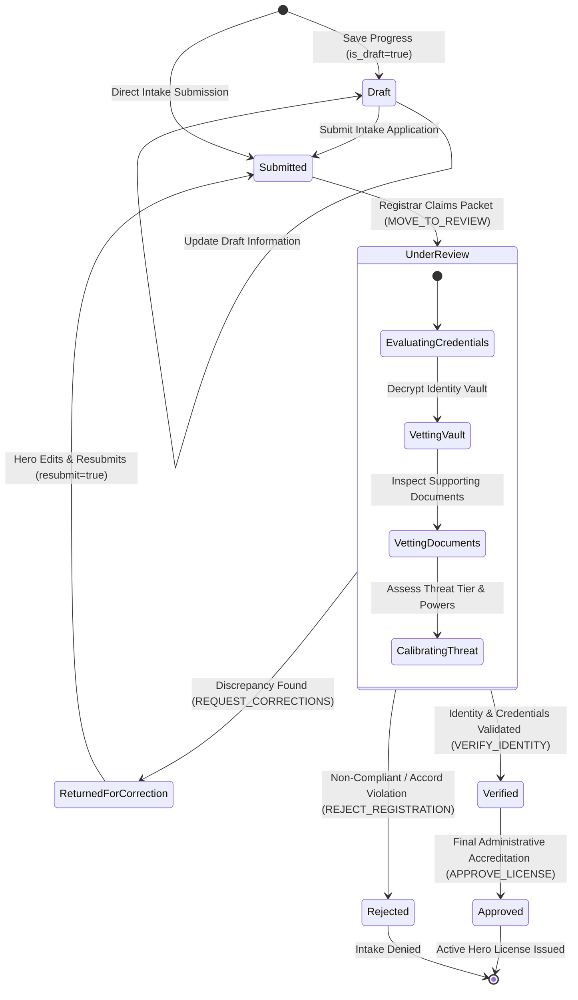
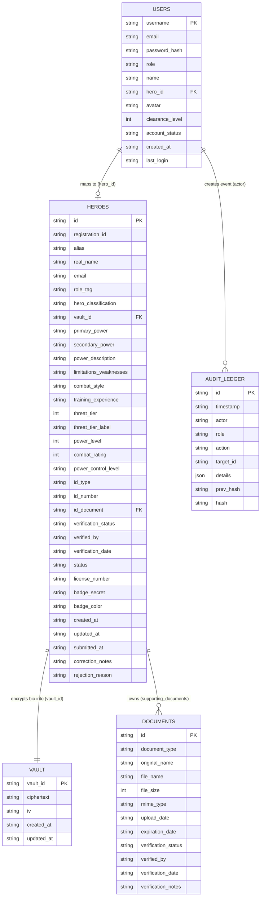

# System Documentation Audit: Hero Registration Module

An exhaustive audit of the **Global Hero Registration & Management System (GHRMS)** codebase was conducted across backend scripts, datastores, and frontend templates. The findings below identify implemented, partially implemented, and missing features within the **Hero Registration Module**.

---

### Audit Summary Table

| Category | Item / Feature | Implementation Status | Implementation Details / Grounding Files |
| :--- | :--- | :--- | :--- |
| **Account Creation** | Self-Registration & Callsign Reservation | **IMPLEMENTED** | `frontend/register.html`, `backend/api.php` (`POST /api/heroes/register`), `backend/auth.php` |
| **Account Creation** | Bcrypt Password Hashing | **IMPLEMENTED** | `backend/auth.php`, `backend/api.php` (`password_hash($raw, PASSWORD_BCRYPT)`) |
| **Account Creation** | Direct Session Provisioning | **IMPLEMENTED** | `backend/auth.php`, `backend/api.php` (Auto-logs in applicant upon draft/submission) |
| **Account Creation** | Email Verification Link (SMTP) | **NOT IMPLEMENTED** | Email is recorded for alerts, but no SMTP outbound mailer exists. |
| **Personal Identity** | Civilian Personal Information Intake | **IMPLEMENTED** | `frontend/register.html` (Step 1), `backend/api.php` |
| **Personal Identity** | Biometric Face Photo Upload | **IMPLEMENTED** | `frontend/register.html`, `backend/api.php` (`POST /api/upload-avatar`, `POST /api/heroes/{id}/avatar`) |
| **Personal Identity** | AES-256 Vault Encryption | **IMPLEMENTED** | `backend/crypto.php` (`encryptVault`, `decryptVault`, `AES-256-CBC`), `backend/data/vault.json` |
| **Personal Identity** | Privileged Vault Decryption | **IMPLEMENTED** | `backend/api.php` (`POST /api/heroes/{id}/decrypt-vault`, `GET /api/heroes/{id}/review`) |
| **Hero Specifications** | Powers, Abilities, Weaknesses, Style | **IMPLEMENTED** | `frontend/register.html` (Step 2), `backend/api.php` |
| **Power Assessment** | Threat Tier (0–5), Combat & Output | **IMPLEMENTED** | `frontend/register.html` (Step 3), `backend/config.php` (`THREAT_TIERS`), `backend/api.php` |
| **Supporting Docs** | File Upload (Required & Optional) | **IMPLEMENTED** | `frontend/register.html` (Step 4), `backend/api.php` (`POST /api/heroes/{id}/documents`) |
| **Supporting Docs** | Secure In-Memory/Disk Document Serving | **IMPLEMENTED** | `backend/api.php` (`GET /api/heroes/{id}/documents/{docId}`) |
| **Supporting Docs** | Document Expiration Tracking | **PARTIALLY IMPLEMENTED**| Stored in `expiration_date` attribute; automated cron alert notifications are planned. |
| **Workflow** | Draft Saving & Resumption | **IMPLEMENTED** | `frontend/register.html` (`saveDraft()`), `backend/api.php` (`is_draft: true` sets `status: Draft`) |
| **Workflow** | Intake Submission (`Draft` → `Submitted`) | **IMPLEMENTED** | `frontend/register.html` (`submitRegistration()`), `backend/api.php` |
| **Workflow** | Queue Management & `Under Review` | **IMPLEMENTED** | `frontend/registrar.html`, `backend/api.php` (`action: MOVE_TO_REVIEW`) |
| **Workflow** | Correction Loop (`Returned for Correction`) | **IMPLEMENTED** | `backend/api.php` (`action: REQUEST_CORRECTIONS`), `frontend/hero.html`, `frontend/register.html` |
| **Workflow** | Resubmission (`Resubmitted` → `Submitted`) | **IMPLEMENTED** | `frontend/hero.html` (`resubmitRegistration()`), `backend/api.php` (`resubmit: true`) |
| **Workflow** | Identity & Document Verification | **IMPLEMENTED** | `backend/api.php` (`action: VERIFY_IDENTITY`, `POST /api/heroes/{id}/documents/{docId}/verify`) |
| **Workflow** | Administrative Approval & Licensing | **IMPLEMENTED** | `backend/api.php` (`action: APPROVE_LICENSE` generates `GHRMS-LIC-...` and sets `Approved`) |
| **Workflow** | Application Rejection | **IMPLEMENTED** | `backend/api.php` (`action: REJECT_REGISTRATION` records reason and sets `Rejected`) |
| **Security & Audit** | Role-Based Access Control (RBAC) | **IMPLEMENTED** | `backend/auth.php` (`AuthService::requireRole`), `router.php` |
| **Security & Audit** | SHA-256 Chained Cryptographic Ledger | **IMPLEMENTED** | `backend/crypto.php` (`appendAudit`, `verifyAuditChain`), `backend/data/audit_ledger.json` |
| **Administration** | Admin User Account Management | **IMPLEMENTED** | `frontend/admin.html`, `backend/api.php` (`/api/admin/users`) |
| **Database** | Concurrency Lock Engine (`flock`) | **IMPLEMENTED** | `backend/storage.php` (`JsonStorage::transaction`, `LOCK_EX` / `LOCK_SH`) |

#### Files and Modules Examined
- **Backend Core**: `backend/config.php`, `backend/auth.php`, `backend/crypto.php`, `backend/storage.php`, `backend/api.php`, `router.php`
- **Frontend Pages & Scripts**: `frontend/register.html`, `frontend/hero.html`, `frontend/js/hero.js`, `frontend/registrar.html`, `frontend/js/registrar.js`, `frontend/admin.html`, `frontend/js/admin.js`, `frontend/login.html`
- **Datastores**: `backend/data/heroes.json`, `backend/data/vault.json`, `backend/data/users.json`, `backend/data/audit_ledger.json`, `backend/data/documents/`

---

# GHRMS Hero Registration Module Documentation

```
================================================================================
GLOBAL HERO REGISTRATION AUTHORITY (GHRMS)
SYSTEM COMPONENT: HERO REGISTRATION MODULE
SPECIFICATION & TECHNICAL REFERENCE MANUAL
CLASSIFICATION: RESTRICTED // ACCORD STANDARD GHRMS-701A
================================================================================
```

---

## 1. Introduction

### 1.1 System Overview
The **Global Hero Registration & Management System (GHRMS)** is an administrative, security-governed infrastructure designed to enforce the provisions of the municipal and international **Superhuman Accords**. The **Hero Registration Module** serves as the primary intake, validation, vetting, and identity-vaulting gateway for superhuman operatives entering official civil service.

### 1.2 Purpose of the Module
The Hero Registration Module standardizes the onboarding process for all enhanced individuals. It captures civilian legal identities, isolates and encrypts classified bio-data, classifies tactical power mechanisms, gathers regulatory supporting documentation, and provides an audited administrative pipeline for verification, correction, and official licensing.

### 1.3 Technology Stack
- **Backend Core**: Native PHP 8.2+ with strict typing (`declare(strict_types=1);`). No external framework dependencies; operates via a hardened front controller (`router.php`) and REST JSON dispatcher (`backend/api.php`).
- **Cryptography**: OpenSSL (`aes-256-cbc`), PBKDF2/HMAC-SHA256, Bcrypt password hashing (`PASSWORD_BCRYPT`).
- **Data Persistence**: Atomic, transactional JSON flat-file storage with POSIX kernel file locks (`flock`) preventing race conditions without requiring a relational database engine.
- **Frontend Architecture**: Modern semantic HTML5, Vanilla JavaScript (ES6+), custom CSS variables, and responsive layout styling.
- **Storage Layer**: Dedicated, perimeter-isolated binary directories for biometric facial portraits (`/frontend/uploads/avatars/`) and confidential documents (`/backend/data/documents/`).

### 1.4 Target Audience
This documentation is intended for systems architects, security clearance auditors, lead software engineers, registrar administrative officers, and municipal system administrators responsible for operating or extending GHRMS.

---

## 2. Objectives

1. **Guaranteed Identity Privacy**: Prevent civilian doxxing or identity leakage by strictly segregating public hero aliases from civil identities through an AES-256-CBC encrypted vault.
2. **Standardized Superhuman Classification**: Calibrate all power outputs against the 6-tier Accord Threat Scale (Tier 0 Cosmic to Tier 5 Street) and assign appropriate operational classifications.
3. **Multi-Stage Review Workflow**: Support draft creation, formal submission, administrative correction requests, resubmission, identity verification, and final license accreditation.
4. **Tamper-Evident Accountability**: Record all administrative lifecycle actions (vault decryption, document review, status alteration, license grant) in an immutable, cryptographically chained SHA-256 audit ledger.
5. **Zero-Trust Administrative Segregation**: Enforce server-side Role-Based Access Control (RBAC) ensuring normal heroes cannot inspect peer registrations or access administrative queues.

---

## 3. Scope and Limitations

### 3.1 In-Scope (Hero Registration Module)
- Self-service onboarding wizard for new applicants (`frontend/register.html`).
- Account credential provisioning and Bcrypt password hashing.
- Civilian bio-data encryption into isolated datastores (`backend/data/vault.json`).
- Biometric facial photo capture and validation.
- Superhuman power specifications and threat assessment data intake.
- Upload, secure storage, and review of required and optional supporting documents.
- State-machine registration lifecycle (`Draft` → `Submitted` → `Under Review` → `Verified` → `Approved` / `Rejected` / `Returned for Correction`).
- Hero self-service status tracking, correction updates, and resubmissions (`frontend/hero.html`).
- Registrar desk intake queue, document verification, correction dispatching, and licensing (`frontend/registrar.html`).
- Super Admin user provisioning and registration management (`frontend/admin.html`).

### 3.2 Out-of-Scope (Other GHRMS Modules)
- Sentinel automated biometric checkpoint patrol hardware and camera streaming.
- Incident report logging and third-party municipal damage claims reconciliation.
- OpenWeatherMap tactical meteorological integration.
- Public hero search registry for unverified civilian browsing.

### 3.3 Technical Limitations
- **Datastore Concurrency**: Storage uses file-based transactional locks (`JsonStorage`). High-volume write throughput (thousands of concurrent registrations per second) is bounded by OS disk I/O.
- **Outbound Email**: Email addresses are collected and validated, but automated outbound SMTP email dispatching is not integrated. Verification notices appear within the application UI.

---

## 4. User Roles and Permissions

GHRMS implements a 5-tier clearance hierarchy defined in `backend/auth.php`:

```
Clearance Level 5: SUPER_ADMIN (Command Authority)
       ▲
Clearance Level 4: ADMIN (Administrative Officer)
       ▲
Clearance Level 3: REGISTRAR (Intake & Licensing Authority)
       ▲
Clearance Level 2: ASSESSOR (Tactical Power Calibrator)
       ▲
Clearance Level 1: HERO (Registered Operative / Applicant)
```

### 4.1 Role Responsibilities

#### HERO (Clearance Level 1)
- Create account credentials and initial registration packets.
- Save progress as `Draft` and return later to complete.
- Submit registration packets for administrative evaluation.
- Upload official biometric portraits and supporting documents.
- View real-time registration review status and assigned threat tiers.
- Review registrar correction notes when status is `Returned for Correction`.
- Modify erroneous information and resubmit registration packets.
- Access accredited hero operative profile and anti-spoof field badge once `Approved`.

#### ADMIN (Clearance Level 4) & REGISTRAR (Clearance Level 3)
- Inspect all registration packets in the administrative queue.
- Decrypt confidential civilian identity vaults for official vetting.
- Verify identity credentials and mark individual supporting documents as `Verified` or `Rejected`.
- Calibrate threat tiers, power ratings, combat proficiencies, and sector jurisdictions.
- Dispatch formal correction requests (`Returned for Correction`) with specific instructions.
- Approve registration packets and issue accredited license numbers (`GHRMS-LIC-...`).
- Reject non-compliant applications with formal recorded justifications.
- Add administrative verification notes.

#### SUPER_ADMIN (Clearance Level 5)
- All privileges of `ADMIN` and `REGISTRAR`.
- Create, manage, and delete administrative personnel accounts.
- Reset security passkeys for any operative or administrative staff.
- Permanently purge deleted hero registration packets from the registry.
- Inspect and verify the integrity of the SHA-256 chained audit ledger.

### 4.2 Hero Registration RBAC Matrix

| System Action / Operation | HERO | REGISTRAR | ASSESSOR | ADMIN | SUPER_ADMIN |
| :--- | :---: | :---: | :---: | :---: | :---: |
| Self-Register (`POST /api/heroes/register`) | **Yes** (Public) | **Yes** | **Yes** | **Yes** | **Yes** |
| Save Draft (`is_draft: true`) | **Yes** | **Yes** | **Yes** | **Yes** | **Yes** |
| Edit Own Draft / Returned Record | **Yes** | **Yes** | **Yes** | **Yes** | **Yes** |
| Resubmit Registration | **Yes** | **Yes** | **Yes** | **Yes** | **Yes** |
| View Own Record (`GET /api/heroes/{id}`) | **Yes** | **Yes** | **Yes** | **Yes** | **Yes** |
| Browse All Queue Applications (`GET /api/heroes`) | **No** (403) | **Yes** | **Yes** | **Yes** | **Yes** |
| Decrypt Civilian Vault (`POST /api/heroes/{id}/decrypt-vault`)| **No** (403) | **Yes** | **No** (403) | **Yes** | **Yes** |
| Verify Document (`POST .../documents/{id}/verify`) | **No** (403) | **Yes** | **No** (403) | **Yes** | **Yes** |
| Request Corrections (`action: REQUEST_CORRECTIONS`) | **No** (403) | **Yes** | **No** (403) | **Yes** | **Yes** |
| Approve Registration (`action: APPROVE_LICENSE`) | **No** (403) | **Yes** | **No** (403) | **Yes** | **Yes** |
| Reject Registration (`action: REJECT_REGISTRATION`) | **No** (403) | **Yes** | **No** (403) | **Yes** | **Yes** |
| Hard Delete Registration Record | **No** (403) | **No** (403) | **No** (403) | **No** (403) | **Yes** |
| Manage Staff Accounts (`/api/admin/users`) | **No** (403) | **No** (403) | **No** (403) | **Yes** | **Yes** |

---

## 5. Functional Requirements

### FR-1: Account Creation & Authentication Provisioning
- The system must provide a public self-registration portal (`frontend/register.html`).
- The system must validate that the requested callsign/username is unique and does not collide with reserved municipal identifiers (`commander`, `admin`, `sarah.chen`, `root`, `system`, `ghrms`, `registrar`, `superadmin`).
- Passwords must be hashed using `PASSWORD_BCRYPT` with cost factor 12 before persistence to `users.json`.
- The system must automatically provision an authenticated PHP session cookie upon initial submission or draft creation, allowing the applicant immediate access to their operative portal (`frontend/hero.html`).

### FR-2: Classified Identity Vaulting
- All civilian personal information (Legal Real Name, Government ID Number, Date of Birth, Gender, Contact Number, Safehouse Address, Emergency Contacts) must be encrypted via OpenSSL using AES-256-CBC.
- Encrypted ciphertext and unique 16-byte initialization vectors (`iv`) must be written to an isolated datastore (`backend/data/vault.json`), referenced in the public record solely by a randomized identifier (`vlt_...`).
- Decryption must be strictly guarded by `AuthService::requireRole(['REGISTRAR', 'ADMIN', 'SUPER_ADMIN'])`.
- Decryption attempts must trigger an unalterable audit event in `audit_ledger.json`.

### FR-3: Biometric Face Photo Enrollment
- The system must accept face photo uploads via multipart/form-data or Base64 data URI up to 8MB.
- The system must strictly restrict file types to authentic PNG, JPG, JPEG, and WEBP formats using PHP `finfo` MIME validation.
- Uploaded photos must be stored with randomized filenames (`face_...`) in `/frontend/uploads/avatars/`.

### FR-4: Superhuman Specifications Intake
- Applicants must provide their Primary Superhuman Power, Power Mechanism Description, Limitations/Weaknesses, and Training & Field Experience.
- Applicants may declare Secondary Powers, Key Abilities, Non-Powered Skills, Tactical Strengths, Tactical Gear Manifests, and Preferred Sector Jurisdictions.

### FR-5: Threat & Combat Calibration
- The system must capture an assigned Threat Tier between Tier 0 (Cosmic) and Tier 5 (Street).
- The system must capture calibrated Power Output Level (1–100), Combat Rating (1–100), Power Control Level (`Novice`, `Competent`, `Mastered`, `Absolute`), and Operative Standing (`Hero` vs `Sidekick`).

### FR-6: Supporting Document Intake & Management
- Applicants must submit required supporting documents: **Official ID** and **Hero Certification**.
- Applicants may submit optional documents: **Training Certificate**, **Authorization Document**, and **Other Supporting Documents**.
- Document uploads must accept PDF, PNG, JPG, JPEG, and WEBP up to 12MB.
- Documents must be assigned unique identifiers (`doc_...`), isolated outside public web roots in `/backend/data/documents/`, and served strictly through authenticated binary streaming (`GET /api/heroes/{id}/documents/{docId}`).

### FR-7: Administrative Evaluation & Correction Loop
- Authorized administrative officers must be able to place submitted applications into `Under Review`.
- If an application is deficient, the administrator must be able to return the registration (`Returned for Correction`) with recorded correction notes.
- When an application is returned for correction, the system must unlock editing for the hero owner while displaying an explanatory alert banner on both `frontend/hero.html` and `frontend/register.html`.
- Upon modifying data or uploading amended documents, the hero owner can trigger a resubmission, restoring the status to `Submitted` and re-entering the review queue.

### FR-8: Identity & Document Verification
- Administrative officers must verify individual supporting documents with status flags (`Verified`, `Rejected`, `Pending`) and verification notes.
- Verifying the primary **Official ID** document must synchronize the overall hero identity verification status to `Verified`.

### FR-9: Licensing Accreditation & Rejection
- Administrative officers must have the authority to grant official accreditation (`APPROVE_LICENSE`), transitioning status to `Approved`, updating badge indicator colors to `green`, and generating a federal license number (`GHRMS-LIC-YYYY-XXXX`).
- Administrative officers must have the authority to reject applications (`REJECT_REGISTRATION`), transitioning status to `Rejected`, setting badge indicator colors to `red`, and recording official rejection findings.

---

## 6. Hero Registration Fields

### 6.1 Account Information

| Field Name | Backend Property | Storage Datastore | Data Type | Required / Optional | Description |
| :--- | :--- | :--- | :--- | :--- | :--- |
| **Hero Registration ID** | `registration_id` / `id` | `heroes.json` | String | Auto-generated | Formatted identifier (e.g. `GHRMS-REG-2026-00F2C4`) and record key (`hero_...`). |
| **Username / Callsign** | `username` / `alias` | `users.json`, `heroes.json` | String | **Required** | Unique system login handle and public operative callsign. |
| **Email Address** | `email` | `users.json`, `heroes.json` | String | **Required** | Valid email address for notifications and review alerts. |
| **Password** | `password_hash` | `users.json` | String (Hash) | **Required** | Bcrypt hashed secret passkey (minimum 6 characters on creation). |
| **Account Status** | `account_status` | `users.json` | String | Auto-generated | Default `'Active'` upon credential provisioning. |
| **Registration Date** | `created_at` | `heroes.json`, `users.json` | String (ISO 8601) | Auto-generated | System timestamp when record was created. |
| **Last Login** | `last_login` | `users.json`, `$_SESSION` | String (ISO 8601) | Auto-generated | Updated upon every successful session authentication. |

### 6.2 Personal Civilian Information (Encrypted Vault)

> [!IMPORTANT]
> All fields in this section are encrypted under AES-256-CBC and written to `backend/data/vault.json`. They are not visible in public hero directory queries.

| Field Name | Vault Property | Storage Datastore | Data Type | Required / Optional | Description |
| :--- | :--- | :--- | :--- | :--- | :--- |
| **Hero Callsign** | `alias` | `heroes.json` (Public) | String | **Required** | Public superhero persona name. |
| **Real Legal Name** | `real_name` | `vault.json` (Encrypted) | String | **Required** | Full civilian legal name. |
| **Date of Birth** | `dob` | `vault.json` (Encrypted) | Date (`YYYY-MM-DD`)| **Required** | Applicant birth date for legal age verification. |
| **Gender** | `gender` | `vault.json` (Encrypted) | String | Optional | Enum: `Male`, `Female`, `Non-Binary`, `Other`, `Undisclosed`. |
| **Contact Number** | `contact_number` | `vault.json` (Encrypted) | String | **Required** | Secure civilian telephone / comms link. |
| **Safehouse Address** | `address` | `vault.json` (Encrypted) | String | **Required** | Residential physical address or secure safehouse. |
| **Emergency Contact** | `emergency_contact_name`| `vault.json` (Encrypted) | String | **Required** | Primary emergency contact liaison name. |
| **Emergency Phone** | `emergency_contact_number`| `vault.json` (Encrypted) | String | **Required** | Telephone number of emergency contact. |
| **Relationship** | `relationship` | `vault.json` (Encrypted) | String | **Required** | Relation to operative (e.g. `Handler`, `Spouse`, `Physician`). |
| **Biometric Face Photo** | `avatar` / `profile_picture` | `heroes.json` | String (URI) | Optional | Path to enrolled facial portrait (`/uploads/avatars/...`). |

### 6.3 Hero Information & Tactical Specifications

| Field Name | Backend Property | Storage Datastore | Data Type | Required / Optional | Description |
| :--- | :--- | :--- | :--- | :--- | :--- |
| **Hero Classification** | `hero_classification` | `heroes.json` | String | **Required** | Category (e.g. `Blaster`, `Bruiser`, `Speedster`, `Psionic`, `Tech`). |
| **Combat Style** | `combat_style` | `heroes.json` | String | **Required** | Tactical style (e.g. `Melee Brawler`, `Ranged Tactical`, `Acrobatic`). |
| **Primary Power** | `primary_power` | `heroes.json` | String | **Required** | Primary superhuman power mechanism. |
| **Secondary Powers** | `secondary_power` | `heroes.json` | String | Optional | Auxiliary capabilities or secondary power traits. |
| **Power Description** | `power_description` | `heroes.json` | String | **Required** | Comprehensive technical breakdown of power mechanisms. |
| **Abilities** | `abilities` | `heroes.json` | String | Optional | Discrete superpower feats or applications. |
| **Skills** | `skills` | `heroes.json` | String | Optional | Non-powered skills (e.g. cryptography, hand-to-hand combat). |
| **Strengths** | `strengths` | `heroes.json` | String | Optional | Tactical advantages and situational proficiencies. |
| **Limitations / Weaknesses** | `limitations_weaknesses` | `heroes.json` | String | **Required** | Physiological limits, vulnerabilities, or depletion factors. |
| **Training & Experience**| `training_experience` | `heroes.json` | String | **Required** | Field history, academy certifications, or vigilante experience. |
| **Sector Jurisdiction** | `region` | `heroes.json` | String | Optional | Assigned municipal sector (e.g. `Sector 1 - Metro Downtown`). |
| **Gear Manifest** | `gear_manifest` | `heroes.json` | Array of Strings | Optional | List of specialized tactical equipment and weaponry. |

### 6.4 Power & Threat Assessment Metrics

| Field Name | Backend Property | Storage Datastore | Data Type | Required / Optional | Description |
| :--- | :--- | :--- | :--- | :--- | :--- |
| **Assigned Threat Tier** | `threat_tier` | `heroes.json` | Integer (0–5) | **Required** | 0: Cosmic, 1: Extreme, 2: High, 3: Moderate, 4: Low, 5: Street. |
| **Threat Tier Label** | `threat_tier_label` | `heroes.json` | String | Auto-calculated | Formatted label (e.g. `Moderate (Tier 3)`). |
| **Power Level** | `power_level` | `heroes.json` | Integer (1–100) | **Required** | Calibrated destructive or energetic yield. |
| **Combat Rating** | `combat_rating` | `heroes.json` | Integer (1–100) | **Required** | Tactical acumen, reflex proficiency, and engagement skill. |
| **Power Control Level** | `power_control_level` | `heroes.json` | String | **Required** | Enum: `Novice`, `Competent`, `Mastered`, `Absolute`. |
| **Operative Standing** | `role_tag` | `heroes.json` | String | **Required** | Enum: `Hero` (Primary Operative) or `Sidekick` (Apprentice). |
| **Assessment Notes** | `assessment_notes` | `heroes.json` | String | Optional | Collateral mitigation notes and containment advice. |

### 6.5 Identity Verification Metadata

| Field Name | Backend Property | Storage Datastore | Data Type | Required / Optional | Description |
| :--- | :--- | :--- | :--- | :--- | :--- |
| **Official ID Type** | `id_type` | `heroes.json`, `vault.json` | String | **Required** | Enum: `Government National ID`, `Passport`, `Clearance Badge`, etc. |
| **Official ID Number** | `id_number` / `gov_code`| `heroes.json`, `vault.json` | String | **Required** | Unique national or diplomatic identity number. |
| **Primary ID Document** | `id_document` | `heroes.json` | String (Doc ID) | Optional | Pointer to verified Official ID document record. |
| **Verification Status** | `verification_status` | `heroes.json` | String | Auto-managed | Enum: `Pending`, `Verified`, `Rejected`. |
| **Verified By** | `verified_by` | `heroes.json` | String | Auto-managed | Name of administrative official who completed verification. |
| **Verification Date** | `verification_date` | `heroes.json` | String (ISO 8601) | Auto-managed | Timestamp when verification was certified. |
| **Verification Notes** | `verification_notes` | `heroes.json` | String | Optional | Administrative findings or vetting notes. |

### 6.6 Supporting Documents Metadata

For every document uploaded to `supporting_documents` array in `heroes.json`:

| Field Name | Property Key | Data Type | Required / Optional | Description |
| :--- | :--- | :--- | :--- | :--- |
| **Document ID** | `id` | String | Auto-generated | Unique record identifier (e.g. `doc_a1b2c3d4e5f6`). |
| **Document Type** | `document_type` | String | **Required** | `Official ID`, `Hero Certification`, `Training Certificate`, etc. |
| **Original File Name** | `original_name` | String | Auto-extracted | Client-side file name (e.g. `passport_scan.pdf`). |
| **Stored File Name** | `file_name` | String | Auto-generated | Disk storage name (`doc_...ext`) in `/backend/data/documents/`. |
| **File Size** | `file_size` | Integer | Auto-extracted | File size in bytes (maximum 12MB permitted). |
| **MIME Type** | `mime_type` | String | Auto-extracted | Verified server-detected MIME type (e.g. `application/pdf`). |
| **Upload Date** | `upload_date` | String (ISO 8601) | Auto-generated | Timestamp when file upload was completed. |
| **Expiration Date** | `expiration_date` | Date (`YYYY-MM-DD`) | Optional | Expiration date of document or clearance charter. |
| **Verification Status** | `verification_status` | String | Auto-managed | Enum: `Pending`, `Verified`, `Rejected`. |
| **Verified By** | `verified_by` | String | Auto-managed | Reviewing officer name. |
| **Verification Date** | `verification_date` | String (ISO 8601) | Auto-managed | Timestamp of document verification. |
| **Verification Notes** | `verification_notes` | String | Optional | Notes on document authenticity or legibility. |

---

## 7. Registration Workflow

### 7.1 Workflow State Machine Diagram



### 7.2 Detailed Step-by-Step Flow

#### Phase 1: Intake & Account Creation (`Draft` or `Submitted`)
1. **Applicant Entry**: The operative navigates to `frontend/register.html`.
2. **Data Entry**: The applicant enters account credentials, personal civilian details, power specifications, threat calibrations, and selects document files.
3. **Saving Draft**: If the applicant selects `Save as Draft`:
   - System calls `POST /api/heroes/register` with `is_draft: true`.
   - The civilian identity is encrypted and stored in `vault.json`.
   - Record status is initialized to `Draft` (`registration_step: 1`, `badge_color: 'gray'`).
   - Attached documents are sequentially uploaded.
   - User account is created and an active session is started. The applicant is redirected to `frontend/hero.html`.
4. **Final Submission**: If the applicant selects `Submit Registration`:
   - System calls `POST /api/heroes/register` with `is_draft: false`.
   - Record status is initialized to `Submitted` (`submitted_at: date('c')`, `badge_color: 'yellow'`).
   - Attached documents are uploaded to `/backend/data/documents/`.
   - Record enters the active administrative intake queue.

#### Phase 2: Administrative Review & Vetting (`Under Review`)
1. **Queue Inspection**: A Registrar or Admin opens `frontend/registrar.html` or `frontend/admin.html` and inspects pending applicants.
2. **Review Transition**: The administrator selects the record. The system calls `POST /api/heroes/{id}/assess` with `action: 'MOVE_TO_REVIEW'`, updating status to `Under Review`.
3. **Vault Decryption**: To verify real identity against submitted documents, the administrator clicks `[DECRYPT BIO]`. The system calls `POST /api/heroes/{id}/decrypt-vault`, returning decrypted civilian bio-data and recording a cryptographic audit event.
4. **Document Inspection**: The officer reviews each uploaded document via inline preview (`GET /api/heroes/{id}/documents/{docId}`).
5. **Power Calibration**: Threat tier, power control levels, and combat ratings are verified or updated via `action: 'SET_ASSESSMENT'`.

#### Phase 3A: Correction Flow (`Returned for Correction` → `Resubmitted`)
1. **Correction Request**: If information is missing or a document is illegible, the officer inputs corrective instructions and triggers `action: 'REQUEST_CORRECTIONS'`.
   - Record status updates to `Returned for Correction`.
   - `correction_notes`, `correction_requested_at`, and `correction_requested_by` are saved.
2. **Hero Notification**: When the hero logs into `frontend/hero.html`, a prominent amber alert banner displays the registrar's notes.
3. **Information Amendment**: The hero clicks `Open Full Stepper` (navigating to `/register`) or utilizes the inline editing interface on `/hero`.
4. **Resubmission**: The hero clicks `[RESUBMIT REGISTRATION]`. The system calls `PUT /api/heroes/{id}` with `resubmit: true`:
   - Updated fields and new documents are stored.
   - Status updates back to `Submitted` (`resubmitted_at: date('c')`).
   - The packet re-enters the active registrar review queue.

#### Phase 3B: Rejection Flow (`Rejected`)
1. If the applicant conceals volatile threats, submits fraudulent identity documents, or violates the Superhuman Accords, the administrator selects `Reject Registration`.
2. The system calls `POST /api/heroes/{id}/assess` with `action: 'REJECT_REGISTRATION'` and records the `rejection_reason`.
3. Status changes to `Rejected` (`badge_color: 'red'`). The hero's dashboard displays a termination notice and grounds for rejection.

#### Phase 4: Identity Verification & Licensing Approval (`Verified` → `Approved`)
1. **Identity Verification**: When identity documents match the vaulted data, the officer triggers `action: 'VERIFY_IDENTITY'`:
   - `verification_status` becomes `'Verified'`.
   - System records `verified_by`, `verification_date`, and `verification_notes`.
   - Record status advances to `Verified`.
2. **Final Accreditation**: The officer clicks `[FINAL REGISTRATION CONFIRMATION]`:
   - System calls `POST /api/heroes/{id}/assess` with `action: 'APPROVE_LICENSE'`.
   - Status updates to `Approved`.
   - License number is generated (`GHRMS-LIC-YYYY-XXXX`).
   - Badge status transitions to `green`.
   - The hero is now an accredited operative authorized for municipal deployment.

---

## 8. Identity Verification

Identity Verification in GHRMS protects confidential civilian identities while maintaining rigorous vetting standards.

### 8.1 Encryption Mechanism
- **Cipher Specification**: `AES-256-CBC` via PHP OpenSSL.
- **Key Derivation**: The cryptographic master key is configured via `HRS_MASTER_KEY` in `.env` (or defaults to the Accord Master Key), hashed using SHA-256 into a 256-bit raw binary key:
  ```php
  define('AES_KEY', hash('sha256', getenv('HRS_MASTER_KEY') ?: 'HRS_SECRET_VAULT_KEY_2026_HERO_SYSTEM', true));
  ```
- **Vector Randomization**: Every encryption operation generates a cryptographically secure 16-byte initialization vector (`openssl_random_pseudo_bytes(16)`).
- **Storage Segregation**: Ciphertext and IV are base64-encoded and stored in `backend/data/vault.json`. Public hero records maintain only a reference string (`vault_id`).

### 8.2 Privileged Decryption & Audit Trail
Civilian identity decryption is restricted to administrators holding Clearance Level 3 or higher. Every call to `POST /api/heroes/{id}/decrypt-vault` or `GET /api/heroes/{id}/review` automatically appends an event to the SHA-256 chained audit ledger:

```json
{
  "actor": "Sarah Chen",
  "role": "REGISTRAR",
  "action": "SECRET_BIO_DECRYPTED",
  "target_id": "hero_apex_01",
  "details": {
    "alias": "APEX",
    "vault_id": "vlt_cde51ca58d372ced",
    "reason": "Mandatory identity verification before field license grant"
  }
}
```

### 8.3 In-Person / Face-to-Face (FTF) Evaluation Integration
In accordance with federal protocols, the module supports optional Face-to-Face evaluations via `POST /api/heroes/{id}/ftf-interview`. The examiner records:
- `status`: `Passed`, `Failed`, or `Pending`
- `examiner`: Name of examining official
- `power_stability`: Stability rating under combat stress
- `psych_eval`: Psychological profile clearance
- `notes`: Behavioral evaluation notes

---

## 9. Supporting Documents

### 9.1 Document Types & Requirements

```
Supporting Documents Architecture
├── REQUIRED DOCUMENTS
│   ├── 1. Official ID (Government National ID, Passport, Military Defense ID)
│   └── 2. Hero Certification (Guild license, Academy charter, Municipal registry)
└── OPTIONAL DOCUMENTS
    ├── 3. Training Certificate (Combat academy, Tactical certification, Medical accreditation)
    ├── 4. Authorization Document (Powers jurisdiction waiver, Mentor sponsorship letter)
    └── 5. Other Supporting Documents (Biometric assay, Equipment blueprint, Auxiliary licenses)
```

### 9.2 Upload Validation & Storage Rules
- **Maximum File Size**: 12MB per document.
- **Permitted File Formats**: Strictly limited to `PDF`, `PNG`, `JPG`, `JPEG`, and `WEBP`.
- **MIME Verification**: Validated via PHP `finfo(FILEINFO_MIME_TYPE)` against allowed list:
  `['application/pdf', 'image/png', 'image/jpeg', 'image/webp']`.
- **Storage Location**: Stored on disk in `/backend/data/documents/` using randomized filenames (`doc_` + 12-char hex + extension).
- **Access Control**: Documents cannot be reached via direct web URL. Access is mediated by `GET /api/heroes/{id}/documents/{docId}` which verifies that the requesting party is either the owner hero or an authorized administrative officer.

### 9.3 Verification Attributes
Each document record tracks:
- `verification_status`: `Pending`, `Verified`, or `Rejected`
- `verified_by`: Name of the verifying administrative officer
- `verification_date`: ISO 8601 timestamp
- `verification_notes`: Justification for verification or rejection

---

## 10. Registration Statuses

GHRMS implements the following operational registration statuses defined in `backend/config.php` (`REGISTRATION_STATUSES`):

| Status | Badge Color | Meaning & System Behavior | Next Permitted States |
| :--- | :---: | :--- | :--- |
| **`Draft`** | Gray | Application started but incomplete. The hero can edit all fields and upload documents. Hidden from main registrar review queues. | `Submitted` |
| **`Submitted`** | Yellow | Application complete and queued for administrative evaluation. Field editing is locked for the hero owner. Visible in registrar queue. | `Under Review` |
| **`Under Review`** | Yellow | Administrator has opened and claimed the application for vetting. Identity vault and documents are being evaluated. | `Verified`, `Returned for Correction`, `Rejected` |
| **`Returned for Correction`** | Yellow / Amber | Administrator identified errors or missing documents. Record is unlocked for the hero owner to edit and resubmit. | `Submitted` (via resubmit) |
| **`Verified`** | Cyan / Blue | Civilian identity and supporting credentials verified. Awaiting final licensing confirmation. | `Approved`, `Rejected` |
| **`Approved`** (or `Licensed`)| Green | Operative accredited. Official federal license number issued (`GHRMS-LIC-...`). Authorized for deployment. | `Rejected` (via license revocation) |
| **`Rejected`** | Red | Registration denied due to regulatory non-compliance, Accord violations, or fraudulent documentation. Account suspended. | None (Requires re-application) |

---

## 11. Validation Rules

### 11.1 Client-Side Form Validation (`frontend/register.html`)
- **Step 1 (Account & Personal)**:
  - Callsign, Email, Legal Name, Date of Birth, Contact Number, Safehouse Address, Emergency Contact Name, and Emergency Contact Phone must be non-empty.
  - Password must be at least 6 characters for new registrations.
  - Face Photo must not exceed 8MB.
- **Step 2 (Hero Specifications)**:
  - Primary Power, Power Description, Limitations & Weaknesses, and Training Experience must be non-empty.
- **Step 3 (Power & Threat)**:
  - Threat tier must be an integer between 0 and 5.
  - Power Output Level and Combat Rating must be integers between 1 and 100.
- **Step 4 (Identity & Documents)**:
  - Official ID Type and Official ID Number must be non-empty.
  - Superhuman Accords declaration checkbox (`regConsent`) must be checked to enable submission.

### 11.2 Server-Side API Validation (`backend/api.php`)

```
Input Validation Engine
├── Callsign Verification
│   ├── Format check: alphanumeric, dot, underscore, dash
│   ├── Reserved check: commander, admin, sarah.chen, root, system, ghrms, registrar, superadmin
│   └── Collision check: must not exist in users.json (returns 409 Conflict)
├── Mandatory Field Assertions (if is_draft == false)
│   ├── real_name, id_number (returns 400 Bad Request)
│   └── alias, primary_power (returns 400 Bad Request)
├── File Upload Checks
│   ├── Size constraints: Avatar <= 8MB, Documents <= 12MB (returns 413)
│   ├── Extension whitelist: pdf, png, jpg, jpeg, webp (returns 415)
│   └── finfo MIME detection: application/pdf, image/png, image/jpeg, image/webp (returns 415)
└── Role & Status Transition Assertions
    ├── Editing restricted to Draft or Returned for Correction for hero owners (returns 403)
    └── Staff-only fields (status, verification, license) stripped from hero payloads
```

---

## 12. Security Requirements

### 12.1 Authentication & Session Security
- **Bcrypt Password Storage**: All passwords hashed via `password_hash($password, PASSWORD_BCRYPT)` with cost factor 12. Plaintext passwords are never persisted.
- **Cookie Security Parameters**:
  - `lifetime`: 86,400 seconds (24 hours).
  - `path`: `/`.
  - `httponly`: `true` (prevents JavaScript cookie theft / XSS exploitation).
  - `secure`: Automatically activated when HTTPS is active or `APP_ENV === 'production'` behind reverse proxies (`HTTP_X_FORWARDED_PROTO === 'https'`).
  - `samesite`: `'Lax'` (mitigates Cross-Site Request Forgery).

### 12.2 Server-Side Authorization Perimeter
- `router.php` rejects direct URL access to internal directories (`/backend`, `/tests`, `/scratch`, `/docs`, dotfiles, configuration manifests) returning `403 Forbidden`.
- Every API endpoint invokes `AuthService::requireAuth()` or `AuthService::requireRole()`.
- Data filtering in `GET /api/heroes/{id}` ensures regular heroes receive `403 Forbidden` if attempting to query any operative record other than their own assigned `hero_id`.

### 12.3 Cryptographic Chained Audit Ledger
Every state change, document upload, vault access, and approval is recorded to `backend/data/audit_ledger.json`.
- **Structure**: Each entry contains `id`, `timestamp`, `actor`, `role`, `action`, `target_id`, `details`, `prev_hash`, and `hash`.
- **Chaining**: Entry $N$ computes its SHA-256 hash using the hash of entry $N-1$:
  $$\text{hash}_N = \text{SHA256}(\text{prev\_hash} \mid \text{timestamp} \mid \text{actor} \mid \text{role} \mid \text{action} \mid \text{target\_id} \mid \text{detailsJson})$$
- **Tamper Detection**: `CryptoService::verifyAuditChain()` scans the ledger linearly; any manual tampering or deletion breaks the chain.

---

## 13. Database Structure

The GHRMS database layer is implemented using transactional JSON datastores in `/backend/data/` managed by `JsonStorage` (`backend/storage.php`).

### 13.1 Entity Relationship Diagram (ERD)



### 13.2 Table / Datastore Specifications

#### 1. `heroes.json` (Primary Hero Records)
- **Purpose**: Master registry of public operative profiles, specifications, metrics, and workflow states.
- **Primary Key**: `id` (e.g. `hero_apex_01`, `hero_photon_surge_08d447`).
- **Foreign Keys**: `vault_id` → `vault.json (vault_id)`.
- **Key Attributes**: Listed in Section 6.

#### 2. `vault.json` (Confidential Biometric Identity Vault)
- **Purpose**: Encrypted storage of real civilian legal identities and emergency contacts.
- **Primary Key**: `vault_id` (e.g. `vlt_1099607e0c468026`).
- **Attributes**:
  - `vault_id` (String): Unique identifier.
  - `ciphertext` (String, Base64): OpenSSL encrypted JSON payload.
  - `iv` (String, Base64): 16-byte cryptographic initialization vector.
  - `created_at` (String, ISO 8601): Record creation timestamp.
  - `updated_at` (String, ISO 8601): Last re-encryption timestamp.

#### 3. `users.json` (Authentication Credentials & Roles)
- **Purpose**: Login credentials, clearance levels, and role definitions for all operatives and staff.
- **Primary Key**: `username` (e.g. `apex`, `sarah.chen`, `commander`).
- **Foreign Keys**: `hero_id` → `heroes.json (id)` (null for administrative staff).
- **Attributes**:
  - `username` (String): Normalized unique login handle.
  - `password_hash` (String): Bcrypt hashed password.
  - `role` (String): `HERO`, `REGISTRAR`, `ASSESSOR`, `ADMIN`, `SUPER_ADMIN`.
  - `clearance_level` (Integer): Clearance level (1 to 5).
  - `hero_id` (String, Nullable): Associated hero identifier.
  - `account_status` (String): Status (`Active`).
  - `created_at` / `last_login` (String, ISO 8601): Timestamps.

#### 4. `audit_ledger.json` (Cryptographic Chained Audit Trail)
- **Purpose**: Tamper-evident ledger recording all lifecycle events and vault decryptions.
- **Primary Key**: `id` (e.g. `evt_f49b6cd9e30e`).
- **Attributes**: `timestamp`, `actor`, `role`, `action`, `target_id`, `details`, `prev_hash`, `hash`.

---

## 14. System Architecture

### 14.1 High-Level Component Architecture

```
                    [ CLIENT BROWSER TERMINAL ]
                                │
                                ▼
                   ┌─────────────────────────┐
                   │       router.php        │
                   │ (Perimeter Defense &    │
                   │  Route Normalization)   │
                   └────────────┬────────────┘
                                │
        ┌───────────────────────┴───────────────────────┐
        ▼                                               ▼
[ Static Assets / UI ]                         [ REST JSON API ]
frontend/*.html, css, js                         backend/api.php
- register.html (Intake Stepper)               - Auth Service (auth.php)
- hero.html (Operative Portal)                 - Crypto Engine (crypto.php)
- registrar.html (Registrar Desk)              - Storage Manager (storage.php)
- admin.html (Command Center)                  - File Upload Handlers
                                                        │
                                                        ▼
                                            ┌───────────────────────┐
                                            │ Transactional Storage │
                                            │ backend/data/         │
                                            │ - heroes.json         │
                                            │ - vault.json (AES-256)│
                                            │ - users.json (Bcrypt) │
                                            │ - audit_ledger.json   │
                                            │ - documents/          │
                                            └───────────────────────┘
```

### 14.2 Concurrency & Locking Architecture
To guarantee ACID transactions on flat JSON files without data loss or corruption, `JsonStorage::transaction()` utilizes PHP `flock()`:
1. `fopen($filePath, 'c+b')`: Opens file for writing without truncating immediately.
2. `flock($fp, LOCK_EX)`: Acquires an exclusive kernel lock; concurrent threads wait until released.
3. `stream_get_contents()`: Reads existing data into memory.
4. `callable $modifier(&$data)`: Executes business logic and data modifications in-place.
5. `ftruncate($fp, 0)` & `fwrite($fp, json_encode($data))`: Atomically rewrites modified content.
6. `fflush($fp)` & `flock($fp, LOCK_UN)`: Flushes OS write buffers and releases lock.

---

## 15. UI / Page Documentation

### 15.1 Hero Registration Intake Stepper (`/register` → `frontend/register.html`)
- **Purpose**: Public-facing 4-phase registration stepper for new superhuman applicants.
- **Access Permission**: Public (Unauthenticated) or Authenticated Hero (editing draft/correction).
- **Interface Structure**:
  - **Header**: GHRMS branding, theme toggle, return-to-dashboard navigation, login link.
  - **Banner**: Dynamic alert notification displaying registrar notes if application was returned for correction.
  - **Step 1: Account & Personal Identification**:
    - Biometric Face Photo uploader with real-time scanner line and client preview.
    - Username / Callsign, Email Address, Security Passkey.
    - Real Legal Civilian Name, Date of Birth, Gender, Contact Number, Safehouse Address.
    - Emergency Contact Name, Emergency Phone, Relationship to Hero.
  - **Step 2: Superhuman Power Specifications**:
    - Hero Classification, Combat Style, Primary Power, Secondary Powers, Power Description.
    - Key Abilities, Tactical Skills, Strengths, Limitations & Weaknesses, Training Experience.
    - Assigned Sector Jurisdiction, Tactical Gear Manifest.
  - **Step 3: Power & Threat Assessment**:
    - Threat Tier interactive range slider (Tier 0 Cosmic down to Tier 5 Street) with color-coded tier badge.
    - Power Output Level (1–100) and Combat Rating (1–100) synchronized dual slider/inputs.
    - Power Control Level dropdown, Operative Standing radio buttons (`Hero` vs `Sidekick`).
    - Threat Assessment & Collateral Mitigation Notes.
  - **Step 4: Identity Verification & Supporting Documents**:
    - Official ID Type and Official ID Number.
    - Document file drop cards: **Official ID** (Required), **Hero Certification** (Required), **Training Certificate** (Optional), **Authorization Document** (Optional), **Other Supporting Documents** (Optional).
    - Document expiration date pickers.
    - Previously uploaded files list (rendered when editing existing draft/returned record).
    - Superhuman Accords declaration certification checkbox.
  - **Footer Actions**:
    - `← Previous`: Step backward in wizard.
    - `💾 Save as Draft`: Invokes `saveDraft()`, persisting incomplete data as `Draft`.
    - `Next Step →`: Validates current step before moving forward.
    - `[SUBMIT REGISTRATION]`: Validates all required inputs, submits record, and uploads files.

### 15.2 Hero Operative Portal (`/hero` → `frontend/hero.html`)
- **Purpose**: Authenticated dashboard where heroes review their status, inspect power metrics, correct returned submissions, and access their anti-spoof field badge.
- **Access Permission**: `HERO`, `REGISTRAR`, `SUPER_ADMIN`.
- **Key Modules**:
  - **Registration Status Banner (`#registrationStatusBanner`)**: Dynamic notification strip displaying active status (`Draft`, `Submitted`, `Under Review`, `Returned for Correction`, `Verified`, `Approved`, `Rejected`).
  - **Correction Notice Box**: Renders registrar's specific feedback when returned for correction, offering `[Open Full Stepper]` and `[Resubmit Registration]` buttons.
  - **Operative Profile Cards**: Registered Powers, Combat Profile, Assigned Threat Tier badge, Vaulted Identity status, and Supporting Document Verification summary.
  - **Dynamic Field Badge Modal**: Live time-decaying anti-spoof TOTP verification token and QR code for Sentinel checkpoints.

### 15.3 Registrar Review Desk (`/registrar` → `frontend/registrar.html`)
- **Purpose**: Central administrative triage terminal for reviewing applicants, decrypting identity vaults, verifying supporting documents, requesting corrections, and issuing licenses.
- **Access Permission**: `REGISTRAR`, `ADMIN`, `SUPER_ADMIN` (Clearance Level 3+).
- **Key Modules**:
  - **Intake Queue & Roster Table**: Filterable by application status (`Submitted`, `Under Review`), division (`Hero`, `Sidekick`), threat class, or search query.
  - **Applicant Details Pane**: Displays hero portrait, civilian legal names, power breakdown bars, and verification checklists.
  - **`[DECRYPT BIO]` Action**: Opens authenticated modal to inspect decrypted AES-256 vault bio-data.
  - **Document Inspection & Verification**: Preview supporting documents and mark each as `Verified` or `Rejected`.
  - **Action Toolbar**:
    - `[FINAL REGISTRATION CONFIRMATION]`: Approves application and generates federal license.
    - `[EDIT ALL OPERATIVE INFO]`: Opens full modal to modify classification, threat tiers, and jurisdictions.
    - `[REVOKE LICENSE]`: Revokes active license with recorded reasons.

### 15.4 Super Admin Command Center (`/admin` → `frontend/admin.html`)
- **Purpose**: Executive terminal for managing administrative personnel, auditing system activity, and overseeing federal registry operations.
- **Access Permission**: `ADMIN`, `SUPER_ADMIN` (Clearance Level 4–5).
- **Key Modules**:
  - **Operatives Tab (`#tab-heroes`)**: Directory view with deletion and emergency status flagging capabilities.
  - **Personnel & Users Tab (`#tab-users`)**: Create new Admin/Registrar accounts, assign clearance roles, reset security passkeys, or deactivate accounts.
  - **Chained Audit Ledger Tab (`#tab-audit`)**: Visual inspector for the SHA-256 cryptographic audit chain with real-time integrity verification.

---

## 16. API / Backend Documentation

### 16.1 `POST /api/heroes/register`
- **Purpose**: Creates a new hero registration record (either as `Draft` or full `Submitted` application) and provisions user login credentials.
- **Authentication**: Public (Unauthenticated) or Authenticated.
- **Required Role**: None (Open intake).
- **Request Headers**: `Content-Type: application/json`.
- **Request Body Parameters**:

```json
{
  "is_draft": false,
  "callsign": "vanguard",
  "username": "vanguard",
  "email": "vanguard@heronet.org",
  "password": "Password123!",
  "real_name": "Marcus Vance",
  "dob": "1994-06-12",
  "gender": "Male",
  "contact_number": "+1 (555) 019-4821",
  "address": "742 Evergreen Way, Sector 1 Downtown",
  "emergency_contact_name": "Dr. Arthur Vance",
  "emergency_contact_number": "+1 (555) 019-8800",
  "relationship": "Father",
  "hero_classification": "Bruiser / Heavy Tank",
  "combat_style": "Melee Brawler",
  "primary_power": "Kinetic Density Modulation",
  "secondary_power": "Ground Tremor Emission",
  "power_description": "Increases molecular density to absorb kinetic force...",
  "abilities": "Shockwave stomp, kinetic shield",
  "skills": "Krav Maga, advanced tactical breach",
  "strengths": "High blunt trauma resistance",
  "limitations_weaknesses": "Vulnerable to high-frequency resonance",
  "training_experience": "4 years Sentinel Cadet Academy",
  "threat_tier": 3,
  "power_level": 75,
  "combat_rating": 80,
  "power_control_level": "Competent",
  "role_tag": "Hero",
  "id_type": "Government National ID",
  "id_number": "NAT-99482-MV",
  "region": "Sector 1 - Metro Downtown",
  "avatar": "/uploads/avatars/face_a1b2c3d4.jpg"
}
```

- **Validation Rules**:
  - If `is_draft` is false: `callsign`, `email`, `real_name`, `id_number`, and `primary_power` are mandatory.
  - `callsign` must not collide with existing users or reserved usernames.
- **Response Payload (201 Created)**:

```json
{
  "success": true,
  "message": "Hero registration submitted successfully. Secret identity vaulted with AES-256 and operative account provisioned.",
  "redirect": "/hero",
  "hero": {
    "id": "hero_vanguard_a833dd",
    "registration_id": "GHRMS-REG-2026-F91A20",
    "alias": "vanguard",
    "status": "Submitted",
    "threat_tier": 3,
    "threat_tier_label": "Moderate (Tier 3)",
    "vault_id": "vlt_e6f478528a226f4e"
  },
  "user": {
    "username": "vanguard",
    "email": "vanguard@heronet.org",
    "role": "HERO"
  }
}
```

- **Error Responses**:
  - `400 Bad Request`: Missing mandatory registration fields.
  - `409 Conflict`: Callsign already taken or reserved.

---

### 16.2 `GET /api/heroes`
- **Purpose**: Lists all registration applications and active hero profiles.
- **Authentication**: Required.
- **Required Role**: `REGISTRAR`, `ASSESSOR`, `ADMIN`, `SUPER_ADMIN`.
- **Query Parameters**:
  - `status` (String, optional): Filter by status (`Submitted`, `Under Review`, etc.).
  - `region` (String, optional): Filter by sector jurisdiction.
  - `threat_tier` (Integer, optional): Filter by threat tier (0–5).
  - `search` (String, optional): Keyword search matching callsign, power, or region.
- **Response Payload (200 OK)**:

```json
{
  "success": true,
  "count": 12,
  "data": [
    {
      "id": "hero_apex_01",
      "registration_id": "GHRMS-REG-2026-9GH843",
      "alias": "APEX",
      "status": "Approved",
      "threat_tier": 4,
      "threat_tier_label": "Low (Tier 4)",
      "region": "Sector 1 - Metro Downtown",
      "primary_power": "Kinetic Energy Absorption & Redistribution",
      "verification_status": "Verified"
    }
  ]
}
```

- **Error Responses**:
  - `401 Unauthorized`: No active session.
  - `403 Forbidden`: Authenticated as regular `HERO` (heroes cannot browse the general directory).

---

### 16.3 `GET /api/heroes/{id}`
- **Purpose**: Retrieves complete operative record. If accessed by the owner hero or authorized staff, includes decrypted vault information.
- **Authentication**: Required.
- **Required Role**: Record Owner (`hero_id === id`) OR `REGISTRAR` / `ADMIN` / `SUPER_ADMIN`.
- **Response Payload (200 OK)**:

```json
{
  "success": true,
  "data": {
    "id": "hero_vanguard_a833dd",
    "registration_id": "GHRMS-REG-2026-F91A20",
    "alias": "vanguard",
    "status": "Submitted",
    "threat_tier": 3,
    "primary_power": "Kinetic Density Modulation",
    "supporting_documents": [],
    "vault_info": {
      "real_name": "Marcus Vance",
      "dob": "1994-06-12",
      "contact_number": "+1 (555) 019-4821",
      "address": "742 Evergreen Way"
    }
  }
}
```

- **Error Responses**:
  - `401 Unauthorized`: Not logged in.
  - `403 Forbidden`: Hero attempting to access another operative's profile.
  - `404 Not Found`: Hero identifier does not exist.

---

### 16.4 `GET /api/heroes/{id}/review`
- **Purpose**: Returns complete administrative review packet combining public hero specs and decrypted vault bio-data.
- **Authentication**: Required.
- **Required Role**: `REGISTRAR`, `ADMIN`, `SUPER_ADMIN`.
- **Response Payload (200 OK)**:

```json
{
  "success": true,
  "hero": { "id": "hero_apex_01", "alias": "APEX", "status": "Under Review" },
  "vault": {
    "real_name": "Samuel Wright",
    "id_number": "9GH-8430",
    "dob": "1983-08-21",
    "contact_number": "+1 (555) 012-9844"
  }
}
```

---

### 16.5 `PUT /api/heroes/{id}`
- **Purpose**: Modifies registration record fields. Used by heroes to amend drafts or resubmit returned applications, and by staff to adjust calibrations.
- **Authentication**: Required.
- **Required Role**: Record Owner (`HERO`) OR Staff (`REGISTRAR`, `ADMIN`, `SUPER_ADMIN`).
- **Validation**:
  - If executed by a regular `HERO`, record must be in `Draft` or `Returned for Correction` status.
  - Setting `resubmit: true` updates status to `Submitted` and logs `resubmitted_at`.
  - Setting `submit_draft: true` updates status from `Draft` to `Submitted`.
- **Response Payload (200 OK)**:

```json
{
  "success": true,
  "message": "Hero record and identity verification updated successfully.",
  "data": { "id": "hero_vanguard_a833dd", "status": "Submitted" }
}
```

- **Error Responses**:
  - `403 Forbidden`: Hero attempting to edit an application currently `Submitted` or `Under Review`.

---

### 16.6 `POST /api/heroes/{id}/documents`
- **Purpose**: Uploads and attaches a supporting document to the registration packet.
- **Authentication**: Required.
- **Required Role**: Record Owner (`HERO`) OR Staff.
- **Request Format**: `multipart/form-data`.
- **Parameters**:
  - `document` (File): Binary file (PDF, PNG, JPG, JPEG, WEBP; max 12MB).
  - `document_type` (String): `Official ID`, `Hero Certification`, `Training Certificate`, etc.
  - `expiration_date` (String, optional): Expiration date (`YYYY-MM-DD`).
- **Response Payload (201 Created)**:

```json
{
  "success": true,
  "message": "Document 'passport_scan.pdf' successfully uploaded.",
  "document": {
    "id": "doc_1723cedc4e82",
    "document_type": "Official ID",
    "original_name": "passport_scan.pdf",
    "file_size": 249120,
    "upload_date": "2026-09-28T09:12:00+00:00",
    "verification_status": "Pending"
  }
}
```

- **Error Responses**:
  - `413 Payload Too Large`: File exceeds 12MB.
  - `415 Unsupported Media Type`: Prohibited file extension or MIME type.

---

### 16.7 `GET /api/heroes/{id}/documents/{docId}`
- **Purpose**: Streams binary document file for viewing/download.
- **Authentication**: Required.
- **Required Role**: Record Owner (`HERO`) OR Staff (`REGISTRAR`, `ADMIN`, `SUPER_ADMIN`).
- **Response**: Binary stream with inline `Content-Disposition` header.

---

### 16.8 `POST /api/heroes/{id}/documents/{docId}/verify`
- **Purpose**: Administrative verification of a supporting document.
- **Authentication**: Required.
- **Required Role**: `REGISTRAR`, `ADMIN`, `SUPER_ADMIN`.
- **Request Body**:
  ```json
  {
    "status": "Verified",
    "notes": "Official National Passport hologram verified against registry."
  }
  ```
- **Response Payload (200 OK)**:
  ```json
  {
    "success": true,
    "message": "Document Official ID marked as Verified.",
    "document": {
      "id": "doc_1723cedc4e82",
      "verification_status": "Verified",
      "verified_by": "Sarah Chen",
      "verification_date": "2026-09-28T09:15:00+00:00"
    }
  }
  ```

---

### 16.9 `POST /api/heroes/{id}/decrypt-vault`
- **Purpose**: Decrypts classified civilian legal bio-data. Logs mandatory audit ledger record.
- **Authentication**: Required.
- **Required Role**: `REGISTRAR`, `ADMIN`, `SUPER_ADMIN`.
- **Response Payload (200 OK)**:

```json
{
  "success": true,
  "message": "Vault decrypted. Access logged to audit ledger.",
  "vault_id": "vlt_e6f478528a226f4e",
  "bio_data": {
    "real_name": "Marcus Vance",
    "id_type": "Government National ID",
    "id_number": "NAT-99482-MV",
    "dob": "1994-06-12",
    "contact_number": "+1 (555) 019-4821",
    "address": "742 Evergreen Way",
    "emergency_contact_name": "Dr. Arthur Vance"
  }
}
```

---

### 16.10 `POST /api/heroes/{id}/assess`
- **Purpose**: Executes state transitions and administrative assessment actions on registration packets.
- **Authentication**: Required.
- **Required Role**: Staff (`REGISTRAR`, `ADMIN`, `SUPER_ADMIN`) for review actions; Hero owner for `RESUBMIT`.
- **Supported Actions & Payloads**:
  1. `APPROVE_LICENSE`:
     ```json
     { "action": "APPROVE_LICENSE" }
     ```
     *Transitions status to `Approved`, assigns `license_number` (`GHRMS-LIC-...`), sets `badge_color: 'green'`.*
  2. `REQUEST_CORRECTIONS`:
     ```json
     { "action": "REQUEST_CORRECTIONS", "notes": "Re-upload blurred ID and clarify combat limits." }
     ```
     *Transitions status to `Returned for Correction`, saves `correction_notes`.*
  3. `RESUBMIT`:
     ```json
     { "action": "RESUBMIT" }
     ```
     *Hero action. Transitions status from `Returned for Correction` to `Submitted`.*
  4. `MOVE_TO_REVIEW`:
     ```json
     { "action": "MOVE_TO_REVIEW" }
     ```
     *Transitions status from `Submitted` to `Under Review`.*
  5. `VERIFY_IDENTITY`:
     ```json
     { "action": "VERIFY_IDENTITY", "notes": "Civilian passport and biometric DNA verified." }
     ```
     *Transitions status to `Verified`, sets `verification_status: 'Verified'`.*
  6. `REJECT_REGISTRATION`:
     ```json
     { "action": "REJECT_REGISTRATION", "reason": "Concealment of volatile energy discharge." }
     ```
     *Transitions status to `Rejected`, sets `badge_color: 'red'`.*
  7. `SET_ASSESSMENT`:
     ```json
     {
       "action": "SET_ASSESSMENT",
       "threat_tier": 2,
       "power_level": 85,
       "combat_rating": 80,
       "power_control_level": "Mastered",
       "assessment_notes": "High yield containment protocols required."
     }
     ```
- **Response Payload (200 OK)**:
  ```json
  { "success": true, "message": "Assessment action executed successfully." }
  ```

---

### 16.11 `GET /api/audit-ledger`
- **Purpose**: Retrieves chronological cryptographic audit ledger records.
- **Authentication**: Required.
- **Required Role**: `REGISTRAR`, `ADMIN`, `SUPER_ADMIN`.
- **Response Payload (200 OK)**:

```json
{
  "success": true,
  "count": 142,
  "integrity": { "valid": true, "total_verified": 142 },
  "data": [
    {
      "id": "evt_f49b6cd9e30e",
      "timestamp": "2026-09-28T09:15:00+00:00",
      "actor": "Sarah Chen",
      "role": "REGISTRAR",
      "action": "HERO_LICENSE_APPROVED",
      "target_id": "hero_vanguard_a833dd",
      "prev_hash": "35e7828cb56b92b3dc3760b8cf0244acf0aa2faddd27fa42ab895fbb7d765e8e",
      "hash": "5397ea1cbe968b3b9d28759a7a706ea2ea60abb4c87e1b9cb2ec2f124d90ef1c"
    }
  ]
}
```

---

### 16.12 Administrative Account APIs (`/api/admin/users`)
- `GET /api/admin/users`: Lists staff user accounts (Clearance Level 4+).
- `POST /api/admin/users`: Provisions new staff account (`username`, `email`, `password`, `role`, `clearance_level`).
- `PUT /api/admin/users/{username}/reset-password`: Resets user password (`new_password`).
- `DELETE /api/admin/users/{username}`: Deactivates or removes a user account.

---

## 17. Testing and Test Cases

The test cases below validate implemented business rules, RBAC controls, and data integrity within the Hero Registration Module.

| Test ID | Feature / Area | Preconditions | Test Steps | Expected Result | Implementation Status |
| :--- | :--- | :--- | :--- | :--- | :--- |
| **TC-REG-01** | Public Self-Registration | Visitor is unauthenticated. | 1. Navigate to `/register`.<br>2. Fill mandatory fields across Steps 1–4.<br>3. Check consent box.<br>4. Click Submit. | Application submitted (`status: 'Submitted'`), session established, user redirected to `/hero`. | **IMPLEMENTED** |
| **TC-REG-02** | Save Registration Draft | Visitor is unauthenticated. | 1. Navigate to `/register`.<br>2. Enter Callsign and Email.<br>3. Click `Save as Draft`. | Record created with `status: 'Draft'`, session established, user redirected to `/hero`. | **IMPLEMENTED** |
| **TC-REG-03** | Reserved Callsign Collision | None. | 1. Attempt registration using callsign `commander` or `admin`. | API returns `409 Conflict` with reserved identifier warning message. | **IMPLEMENTED** |
| **TC-REG-04** | Duplicate Account Rejection | User `apex` exists in registry. | 1. Attempt registration using callsign `apex`. | API returns `409 Conflict` stating callsign already registered. | **IMPLEMENTED** |
| **TC-REG-05** | Identity Vault Encryption | TC-REG-01 completed. | 1. Inspect `backend/data/vault.json`.<br>2. Search for applicant real name. | Real name appears only in AES-256 encrypted base64 ciphertext with unique IV. | **IMPLEMENTED** |
| **TC-REG-06** | Document Type Validation | Authenticated as applicant. | 1. Attempt upload of `.exe` or `.sh` script via `/api/heroes/{id}/documents`. | API returns `415 Unsupported Media Type` rejecting prohibited file extension. | **IMPLEMENTED** |
| **TC-REG-07** | Document Size Enforcement | Authenticated as applicant. | 1. Attempt upload of 15MB PDF document. | API returns `413 Payload Too Large` enforcing 12MB ceiling. | **IMPLEMENTED** |
| **TC-REG-08** | Unauthorized Record Inspection | Logged in as Hero (`apex`). | 1. Execute `GET /api/heroes/hero_lumina_02`. | API returns `403 Forbidden` denying cross-hero profile inspection. | **IMPLEMENTED** |
| **TC-REG-09** | Unauthorized Queue Browsing | Logged in as Hero (`apex`). | 1. Execute `GET /api/heroes`. | API returns `403 Forbidden` restricting directory to staff clearance. | **IMPLEMENTED** |
| **TC-REG-10** | Unauthorized Vault Decrypt | Logged in as Hero (`apex`). | 1. Execute `POST /api/heroes/hero_apex_01/decrypt-vault`. | API returns `403 Forbidden` (Decryption requires Level 3+ clearance). | **IMPLEMENTED** |
| **TC-REG-11** | Administrative Vault Decrypt | Logged in as Registrar (`sarah.chen`). | 1. Open applicant record in `/registrar`.<br>2. Click `[DECRYPT BIO]`. | Modal reveals decrypted civil identity; audit ledger logs `SECRET_BIO_DECRYPTED`. | **IMPLEMENTED** |
| **TC-REG-12** | Request Correction Flow | Applicant status is `Under Review`. | 1. Registrar clicks Request Corrections.<br>2. Enters notes and submits. | Status changes to `Returned for Correction`; hero portal displays amber banner. | **IMPLEMENTED** |
| **TC-REG-13** | Hero Lockout When Submitted | Applicant status is `Submitted`. | 1. Hero attempts `PUT /api/heroes/{id}` with new data. | API returns `403 Forbidden` (Editing locked while under active review). | **IMPLEMENTED** |
| **TC-REG-14** | Hero Resubmission | Applicant status is `Returned for Correction`. | 1. Hero updates data in `/register` or `/hero`.<br>2. Clicks `Resubmit Registration`. | Status updates to `Submitted`, `resubmitted_at` timestamp set, re-enters queue. | **IMPLEMENTED** |
| **TC-REG-15** | Document Verification | Document uploaded to packet. | 1. Registrar calls `POST .../documents/{id}/verify` with status `Verified`. | Document status updates to `Verified`; audit ledger logs event. | **IMPLEMENTED** |
| **TC-REG-16** | Registration Approval | Identity verified. | 1. Registrar executes `APPROVE_LICENSE`. | Status updates to `Approved`, license number issued (`GHRMS-LIC-...`), badge turns green. | **IMPLEMENTED** |
| **TC-REG-17** | Application Rejection | Application deficient. | 1. Registrar executes `REJECT_REGISTRATION` with formal reason. | Status updates to `Rejected`, badge turns red, rejection reason saved. | **IMPLEMENTED** |
| **TC-REG-18** | Audit Chain Tamper Detection | Audit ledger has 10+ entries. | 1. Manually alter a character in `audit_ledger.json`.<br>2. Call `CryptoService::verifyAuditChain()`. | System detects hash mismatch, returns `valid: false` with exact broken index. | **IMPLEMENTED** |
| **TC-REG-19** | Admin User Provisioning | Logged in as `commander`. | 1. Call `POST /api/admin/users` to create new Registrar. | New user created with Bcrypt password; can successfully authenticate. | **IMPLEMENTED** |
| **TC-REG-20** | Automated Expiration Alerts | Document expiration date set. | 1. System date exceeds document expiration. | Background notification triggered to hero. | **NOT IMPLEMENTED** (Expiration date stored; background cron alert pending) |

---

## 18. Installation and Configuration

### 18.1 Prerequisites
- **Runtime**: PHP 8.2 or higher.
- **PHP Extensions**:
  - `ext-openssl`: Required for AES-256-CBC identity vaulting and SHA-256 HMAC tokens.
  - `ext-fileinfo`: Required for server-side document MIME type detection.
  - `ext-session`: Required for authenticated clearance sessions.
  - `ext-json`: Required for JSON datastore serialization.

### 18.2 Directory & Permission Setup
Execute the following shell commands in the project root:

```bash
# Ensure secure storage directories exist
mkdir -p backend/data/documents
mkdir -p frontend/uploads/avatars

# Set appropriate POSIX permissions (read/write for web server)
chmod -R 775 backend/data
chmod -R 775 frontend/uploads
```

### 18.3 Environment Configuration (`.env`)
Create or edit `.env` in the project root:

```ini
# Application Mode
APP_ENV=production
APP_DEBUG=false
APP_URL=http://localhost:8000
PORT=8000

# Cryptographic Master Key for Biometric Identity Vault (AES-256)
# Generate a secure 64-character hex or 32+ character random string in production
HRS_MASTER_KEY=4f9b2c8a1e3d7f0b5a6c8e2d4f1a3b5c7e9f0a2b4c6d8e1f3a5b7c9d1e3f5a7b
```

### 18.4 Starting the Local Server
Launch the application using PHP's built-in web server with `router.php` as the front controller:

```bash
php -S 0.0.0.0:8000 router.php
```

Navigate to:
- **Hero Registration Wizard**: `http://localhost:8000/register`
- **Hero Operative Portal**: `http://localhost:8000/hero`
- **Registrar Desk**: `http://localhost:8000/registrar`
- **Super Admin Command Center**: `http://localhost:8000/admin`
- **Sign In Gateway**: `http://localhost:8000/login`

### 18.5 Seed Accounts
If `backend/data/users.json` is missing, `backend/auth.php` auto-seeds default accounts on first load:
- **Super Admin**: Username `commander` / Password `admin123` (Clearance Level 5)
- **Registrar Officer**: Username `sarah.chen` / Password `registrar123` (Clearance Level 3)
- **Admin Officer**: Username `admin` / Password `admin123` (Clearance Level 4)
- **Hero Operative**: Username `apex` / Password `hero123` (Clearance Level 1)

---

## 19. User Guide

### 19.1 For Heroes (Applicants)

#### Completing Your Registration
1. Navigate to `/register`.
2. **Phase 1 (Account & Personal)**:
   - Click the avatar circle to upload your official biometric face photo.
   - Enter your public Callsign, Email, and create a passkey.
   - Enter your civilian legal name, date of birth, contact number, and address.
   - Enter your primary emergency contact liaison details.
3. **Phase 2 (Hero Specifications)**:
   - Select your Hero Classification and Combat Style.
   - Detail your Primary Power and any secondary abilities.
   - Detail power mechanisms, weaknesses, and training background.
4. **Phase 3 (Power & Threat)**:
   - Adjust the Threat Tier slider (Tier 0 to Tier 5).
   - Calibrate Power Output and Combat proficiencies.
5. **Phase 4 (Identity & Documents)**:
   - Select your official ID type and enter the ID number.
   - Upload scans of your **Official ID** and **Hero Certification**.
   - Check the Superhuman Accords declaration checkbox.
6. Click `[SUBMIT REGISTRATION]`. You will be redirected to your Hero Portal (`/hero`).

#### Saving and Resuming a Draft
- At any point while on `/register`, click `💾 Save as Draft`.
- The system will create your account and save your current information under `Draft` status.
- You can log back in at any time, navigate to `/register`, and complete the submission.

#### Responding to Correction Requests
- If the registrar returns your packet for correction, you will see an amber banner on `/hero` containing the registrar's notes.
- Click `Open Full Stepper` or update your details directly.
- After rectifying the requested details or uploading new documents, click `[Resubmit Registration]`.

---

### 19.2 For Registrars & Admins

#### Triage and Queue Management
1. Log into `/registrar` using administrative credentials.
2. In the navigation sidebar, click `[1] REGISTRATION QUEUE`.
3. Select an applicant from the table to populate the right-hand inspection pane.

#### Reviewing and Verifying Identity
1. In the Applicant Details pane, click `[DECRYPT BIO]`.
2. Inspect the decrypted civilian legal name, date of birth, and ID number.
3. In the document list, click uploaded document links to preview files.
4. Under each document, select `Verified` or `Rejected` and input verification notes.

#### Requesting Corrections
1. If details are inconsistent, select `Request Corrections`.
2. Input precise instructions explaining what the hero must rectify.
3. Submit the request. The record status updates to `Returned for Correction`.

#### Approving an Operative
1. Once the identity and supporting credentials are validated, select `Verify Identity`.
2. Click `[FINAL REGISTRATION CONFIRMATION]`.
3. The system accredits the operative, issues an official federal license number, and activates field badge verification.

---

### 19.3 For Super Admins

#### Managing Administrative Personnel
1. Log into `/admin` using Level 5 credentials (`commander`).
2. Navigate to the **Personnel & Users** tab (`#tab-users`).
3. Click `Add Administrative Officer`.
4. Enter the officer's name, username, email, password, and select their role (`REGISTRAR`, `ASSESSOR`, `ADMIN`, or `SUPER_ADMIN`).
5. Click `Create Account`.

#### Auditing Administrative Activity
1. In `/admin`, navigate to the **Chained Audit Ledger** tab (`#tab-audit`).
2. Review all chronological actions, verifying timestamps, actors, targets, and SHA-256 hashes.
3. Click `Verify Audit Integrity` to ensure no ledger records have been tampered with or modified.

---

## 20. Change Log

| Version | Date | Author / Authority | Summary of Changes |
| :--- | :---: | :--- | :--- |
| **v1.0.0** | 2026-09-14 | Systems Engineering Desk | Initial release of GHRMS Hero Registration Module. Core intake form, AES-256 identity vaulting, and JSON transaction storage engine. |
| **v2.0.0** | 2026-09-20 | Registrar Technical Division | Introduced 4-phase registration wizard (`frontend/register.html`) with face photo biometric upload and document storage. |
| **v3.0.0** | 2026-09-24 | Security Clearance Audit | Added SHA-256 cryptographic chained audit ledger (`backend/crypto.php`) with integrity verification engine. |
| **v4.0.0** | 2026-09-27 | Command Authority | Implemented full status lifecycle: `Draft` saving, `Returned for Correction` loops, resubmission handling, and document verification sync. |
| **v4.1.0** | 2026-09-28 | GHRMS Systems Documentation | Published complete technical specification and operational manual for the Hero Registration Module. |
